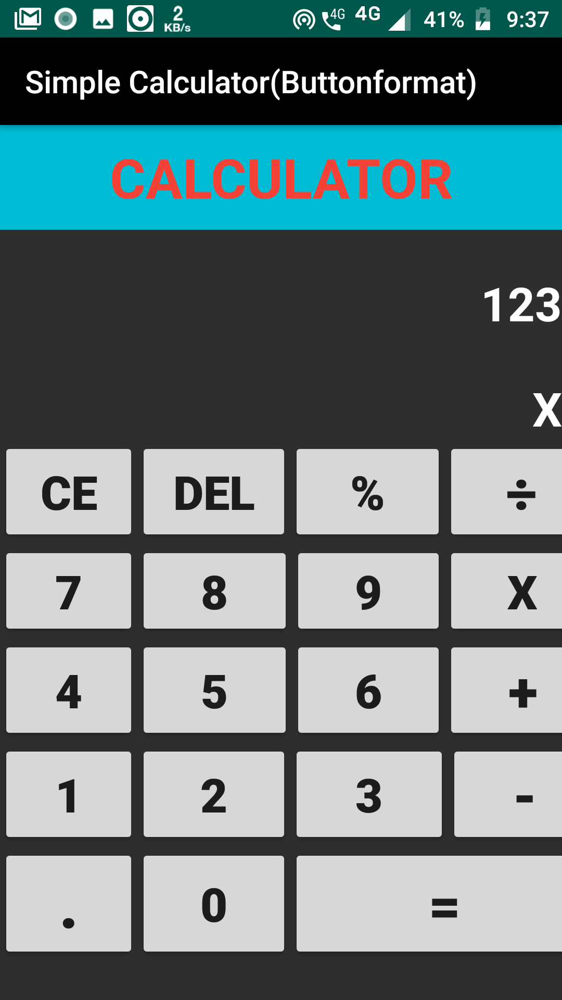
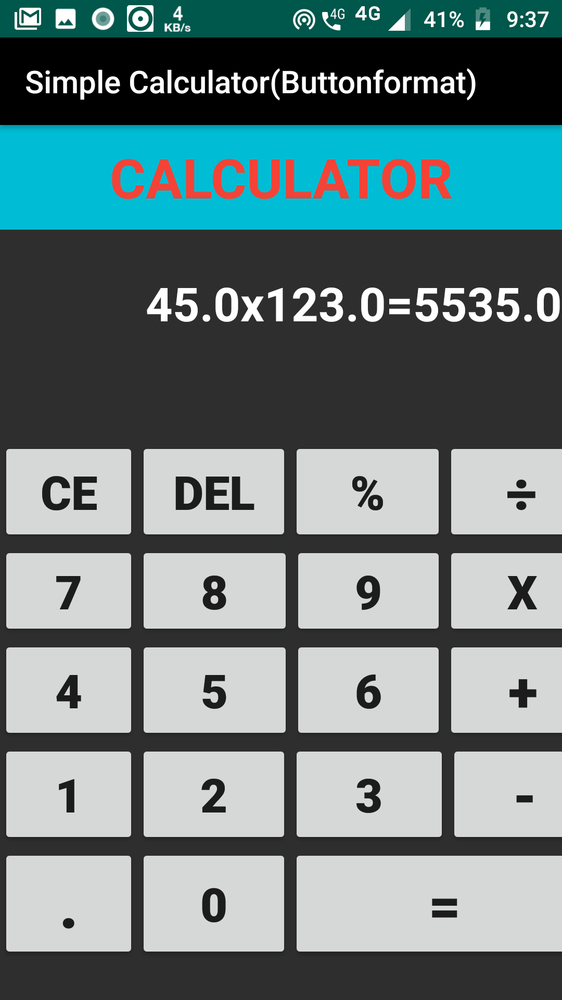
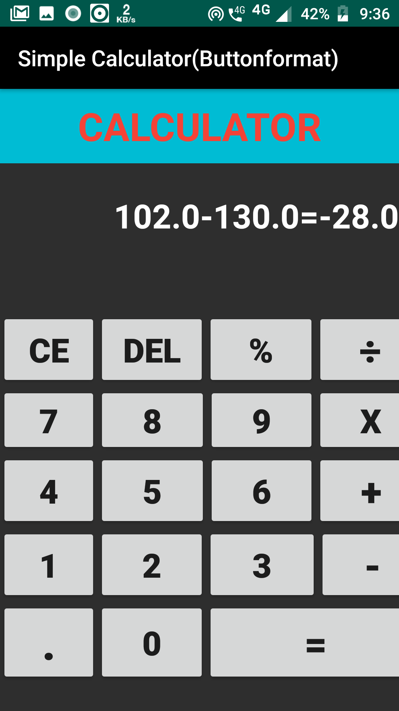

# Basic calculator for Android 

## Introduction
```
Basic Calculator for android with JAVA Backend.  
```


## How to use the code
```
1. Download the apk file from APK folder
2. Install it on an android device.
3. Test it out

```
## Output



<a href = https://www.java.com/en/ ></a>


Check out my Github profile [abhijeet007rocks8](https://github.com/abhijeet007rocks8)
