# ✔ CAVEMAN - THE SAVIOUR (GAME APP)

- ### A 2D physics-based game app created with Android Studio and with simple graphics.  
- ### It is an enemy killing game, where player has to reach the winning score by killing the enemies. The game is also split in different level, making player to challenge different stages of enemy. 
- ### Here SQLite data base is used to store the data of the player.(link to download SQLite DB Browser : https://sqlitebrowser.org/dl/  
****
# ✔ How to see Database Table :
### In Android Studio ,  
- ### View -> Tool Windows -> Device File Explorer -> data -> data -> com.example.caveman -> databases -> SCORE.db 
- ### Save As , this SCORE.db , somewhere when open DB Browser(SQLite), and open SCORE.db database in it. 
****
# ✔ Screenshots :

  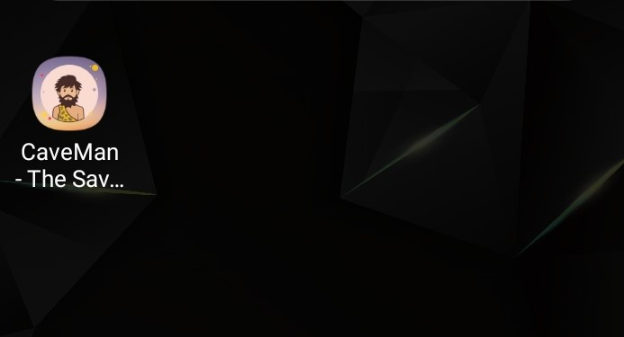 
  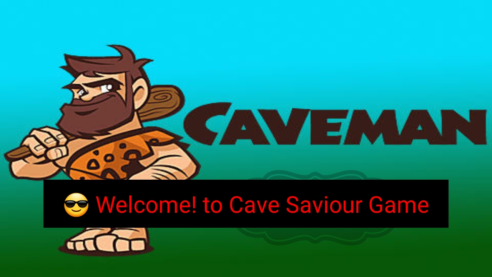 
  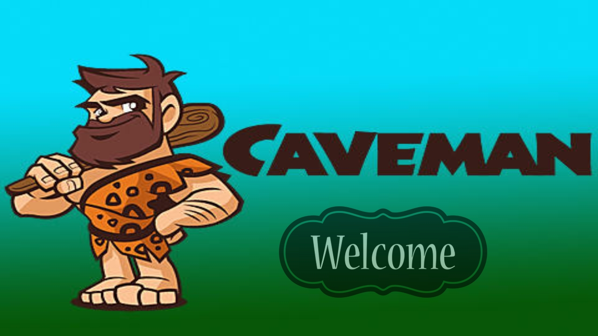 
   
   
  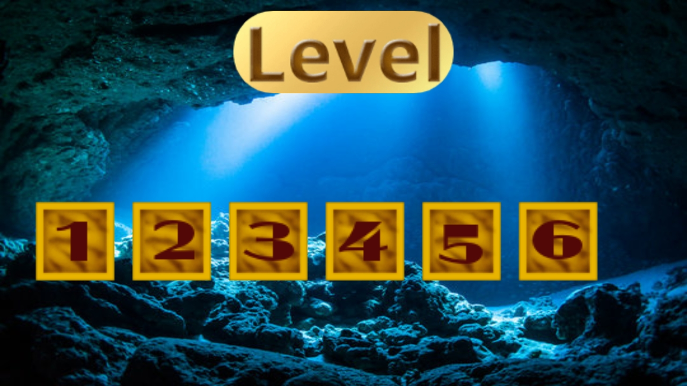 
  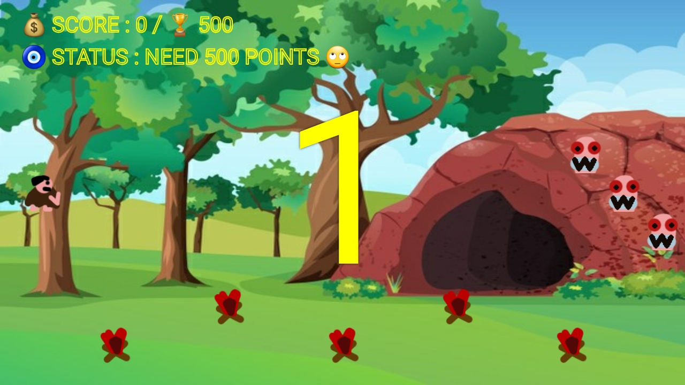 
  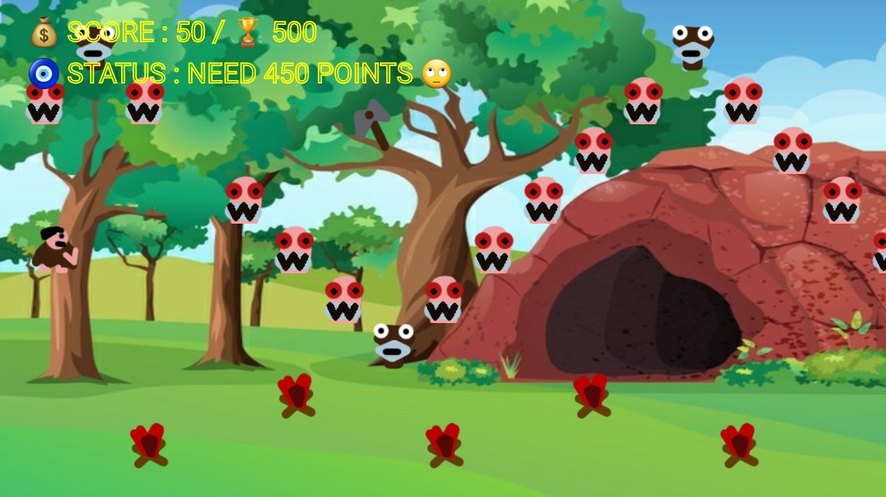 
  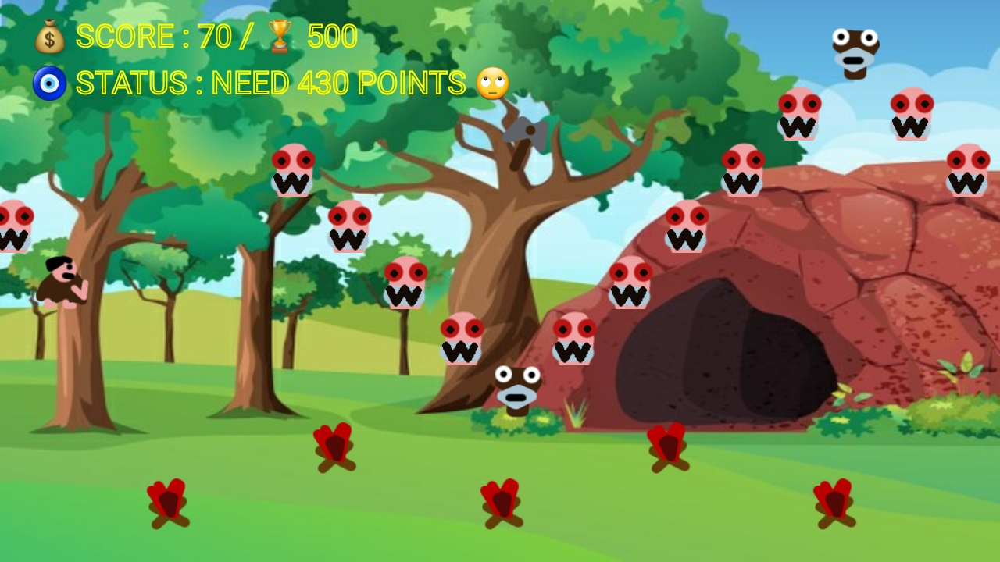 
  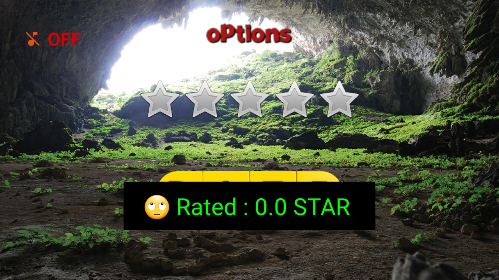 
  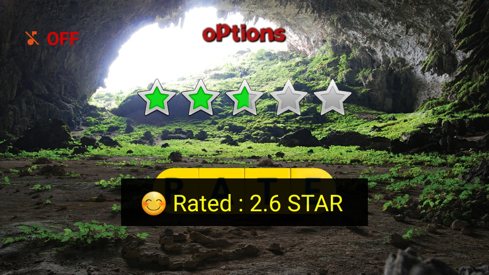 
  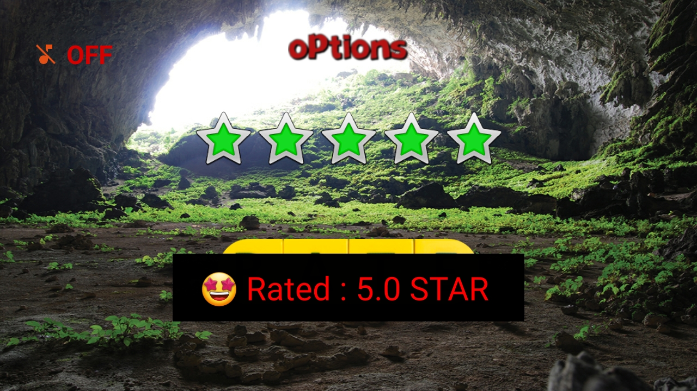 
   
  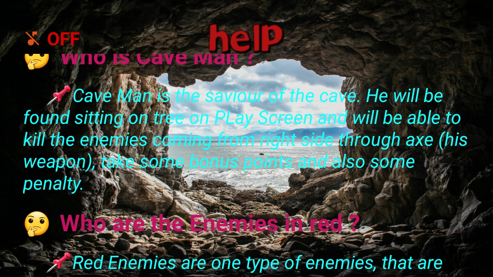 
   
   
   
  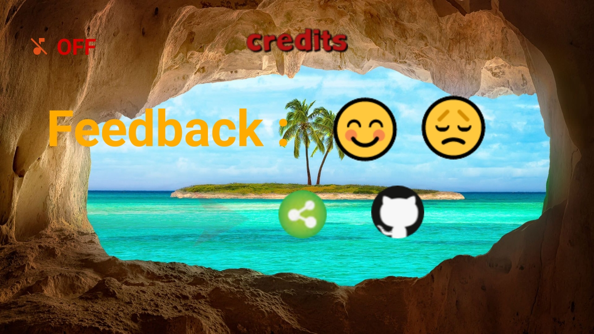 
  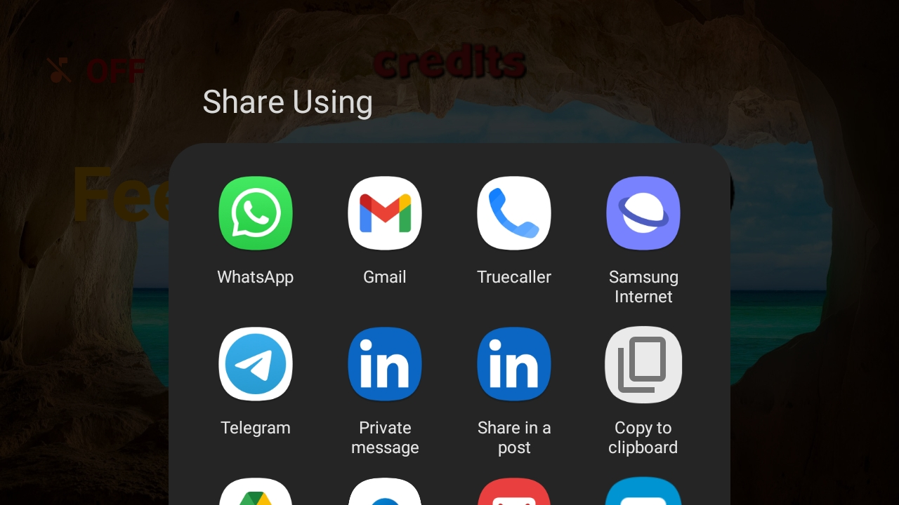 
  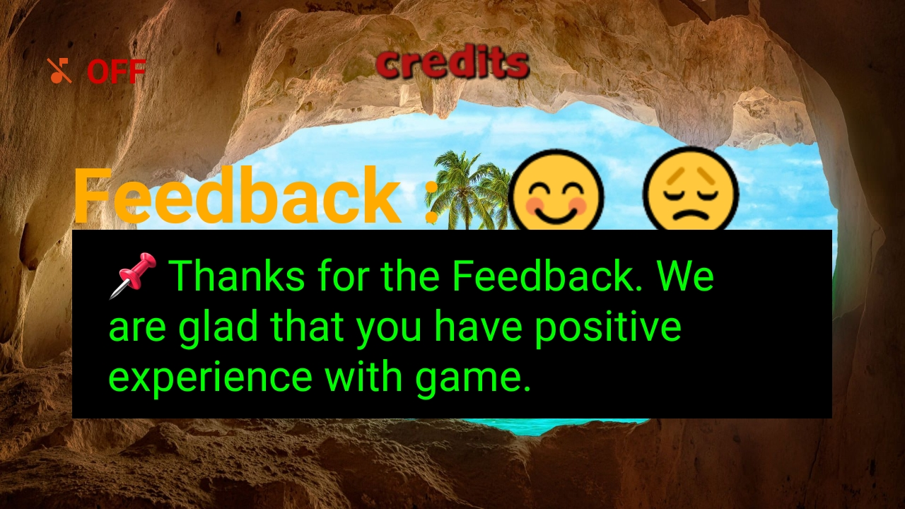 
  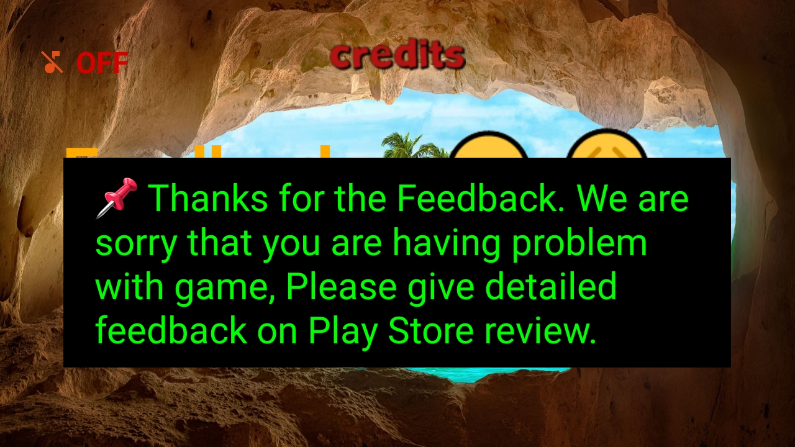 
  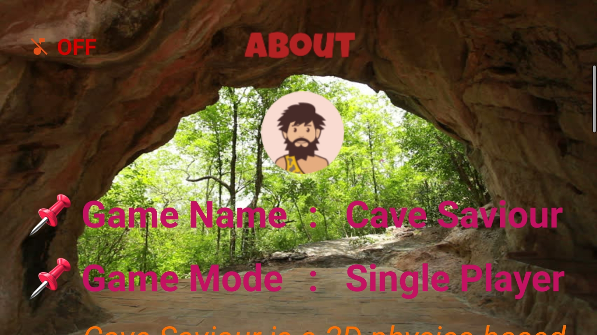 
   

