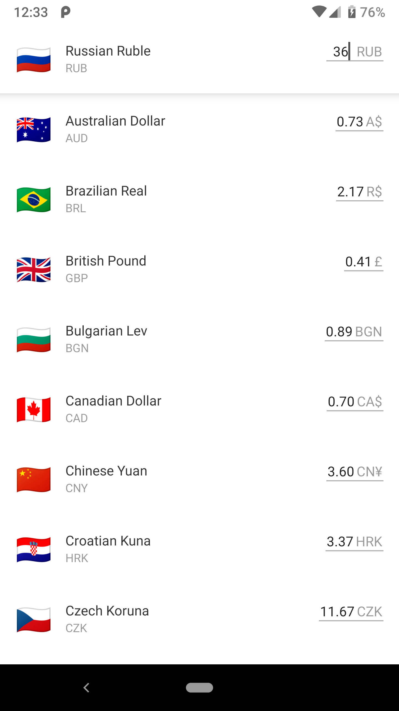

# Currency Converter
***
## Introduction
This is an Android Application to Convert Currencies.

***
## Features
* Converts Currencies.

***
## How to Use
1. Pull the code into your system.
2. Run the project in Android Studio.
3. Select the currency to be converted from and to.
4. Enter the Amount to be converted.
5. Converted Amount will be displayed.

***
## Screenshots

