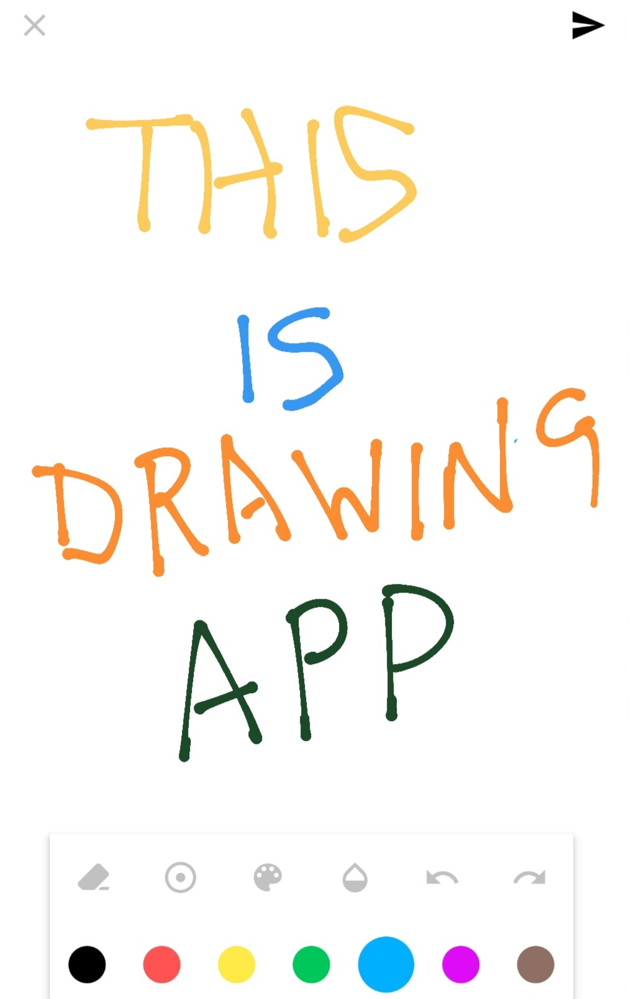

# Drawing App

## Introduction
```
It is an Android drawing application made using a JAVA Programming language.It provides you with a white screen, where you can use your hand as a marker to draw on the white screen, you can also select different size & colour for drawing.
```

## Requirements
```
Android Studio 
Build tools
SDK Version
```

## How to use the code
```
1.Download the given code.
2.Open the project in android studio.
3.Create a Virtual Device/Connect in your android device.
4.Run the Application.
```
## Output

