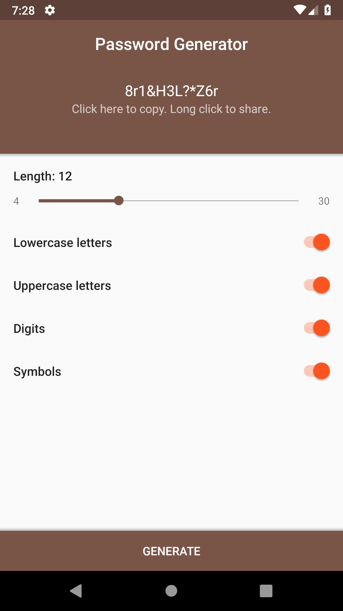

# Random Password Generator
***
## Introduction
This is an Android Application to Generate Random Passwords.

***
## Features
* Generates Strong Passwords.

***
## How to Use
1. Pull the code into your system.
2. Run the project in Android Studio.
3. Select the Length of the Password to be created.
4. Select the entities you want to include like UpperCase alphabets, symbols, digits, etc..
5. Click Generate.
6. Random Password will be successfully Generated.

***
## Screenshots

