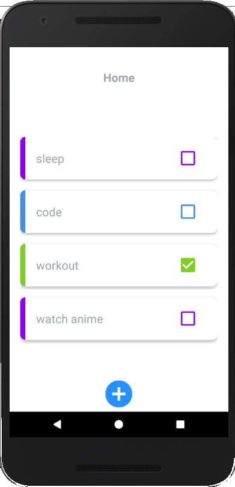
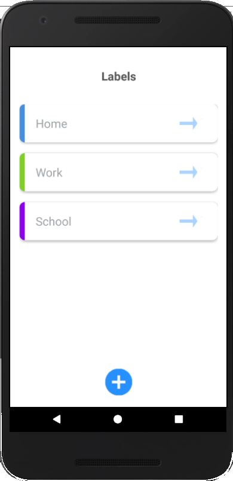

# TodoList

## Introduction
```
It is an Android Todo application made using a JAVA Programming language.This app lets you do all ofyour work much more efficiently, dragging and dropping tasks to reorder them, changing a priority or due date with one.
```

## Requirements
```
Android Studio 
Build tools
SDK Version
```

## How to use the code
```
1.Download the given code.
2.Open the project in android studio.
3.Create a Virtual Device/Connect in your android device.
4.Run the Application.
```
## Output


