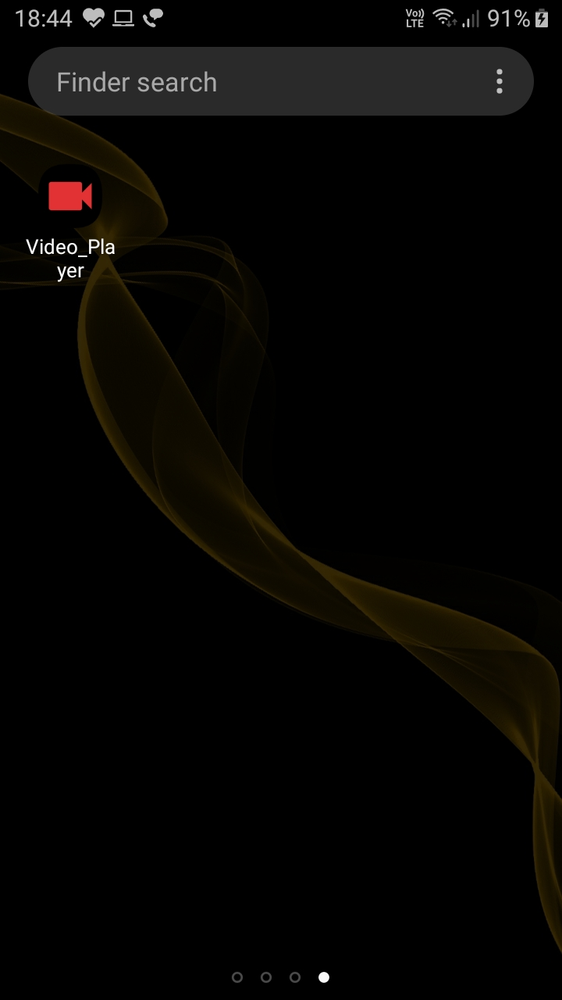
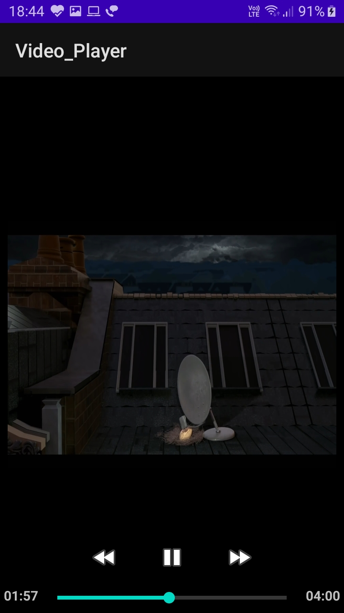
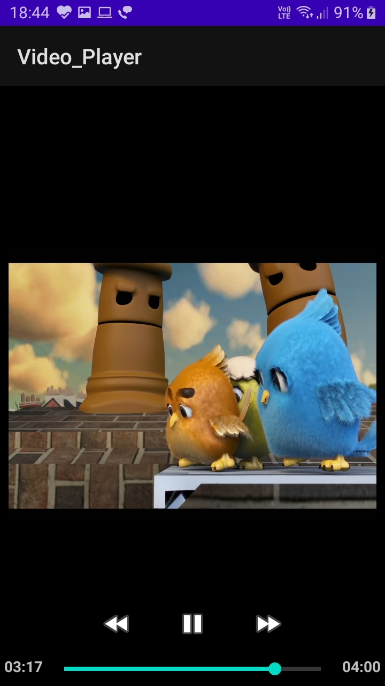
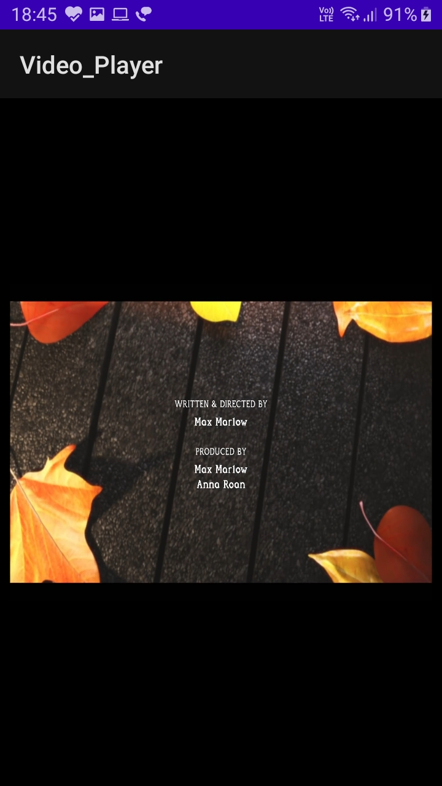
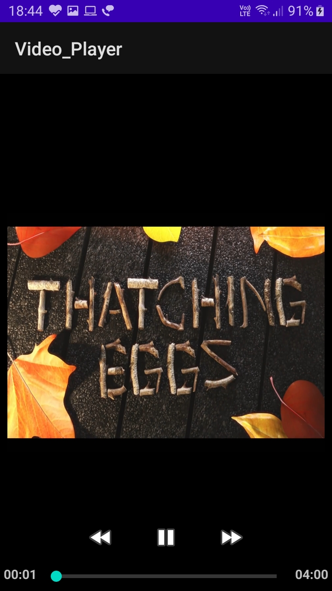

# ✔ Video Player App

****

- ### This is a simple video player which can play video.
- ### It can also allows us to pause at any time, resume at any time, can skip video by 10 sec, can go back in time by 10 sec.

****

# How to run this :
- ### Download the file.
- ### Open it in Android Studio and run it under Physical mobile or Android Emulator.

****

# ✔ Screenshots :

   
   
   
   
   

****

# Below is link to videohow it works :
https://user-images.githubusercontent.com/57003737/123814353-4169f080-d913-11eb-8257-d2965d7cfb5d.mp4