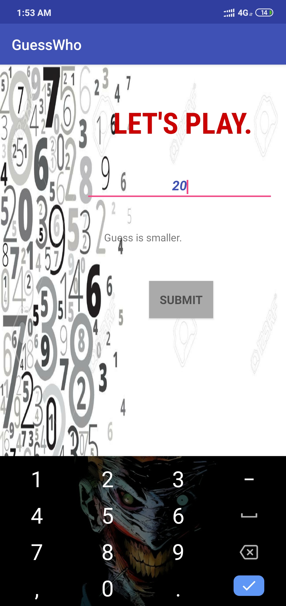

# Guess The Number Game

## Introduction
```
It is a Number Guessing android game developed in java. In this user has to guess the number.An individual will have to guess the number between 0 to 100 within 5 attempts, if not then he/she will loose.
Hints will also be provided after your attempt is wrong.(If your guess is smaller than the answer than it will display that your answer is smaller and vice versa)
```

## Requirements
```
Android Studio 2.2.2
Build tools 24.0.2
SDK Version 24
```

## How to use the code
```
1.Download the given code.
2.Open the project in android studio.
3.Create a Virtual Device/Connect in your android device.
4.Run the Application.
```
## Output




