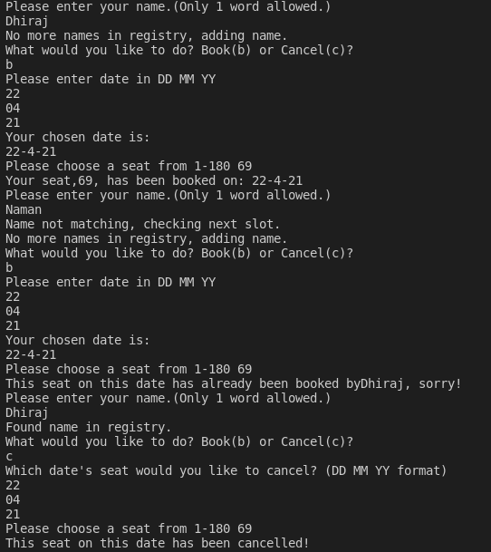

# Airline Booking System
## Introduction
This is Airline Booking System implemented in c++.
This program can be described as a reservation system. It's capable of booking and canceling seats for specific days with user information. For example, a seat on the 15th of May can be booked(the same seat cannot be booked on that specific day), and consequently canceled. It stores data in two 2-D integer arrays. It takes advantage of the fact that all data in an empty array is 0. It iterates over the dates until it finds a date with 0, at which it saves the user given date and seat number into the registry, or it finds a matching date, where it checks if the user given seat matches that registry. The same process is used for cancellation.
# Third-Party Libraries Required :

No External libraries.
Only C++ language

## Steps to try this

1. Clone this repository

```

git clone clone_path

```
## How to use it:

After Cloneing the repository

Open the Airlines_Booking_System folder and run the booking_system.cpp

# Output


