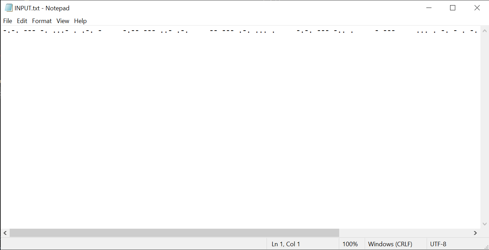
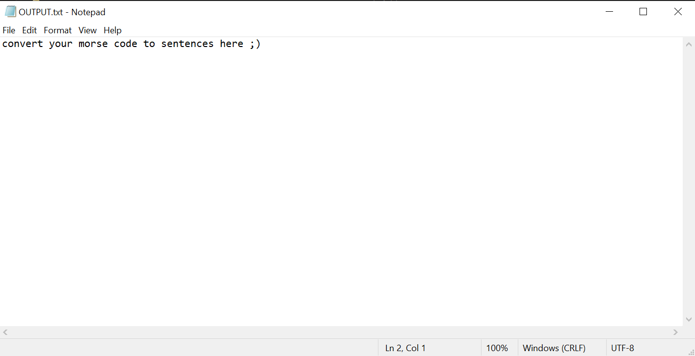

# Morse Code Decryption script

## Description
This is a C++ script that converts morse code to sentences.

#### Steps:
---

- Download or clone the repository
```
git clone https://github.com/Tejas1510/Hacking-Scripts.git
```
- Go to the directory
- Put your input in the INPUT.txt file and save it
- Run the cpp file in VScode
- You will get your output in the OUTPUT.txt file

<br/>

#### INPUT.txt file image:
---



#### OUTPUT.txt file image:
---



#### Language used:
---
- C++
