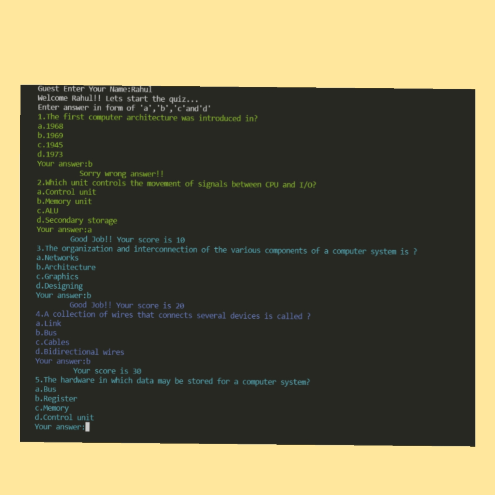

# Quiz
***
## Indroduction
This is the code written in C++ language.It is a quiz about computer oragnization with some coloured text and will give the score and also tells the user about his performance in the quiz..

***
## How to Use
1. Pull the code into your system.
2. Run **code.cpp**.

***
## Input
1.Just enter your name first.
2. You have to answer in options that is a,b,c or d.

## Output
The final score will be displayed and on the basis of that performance of the user will be given.

