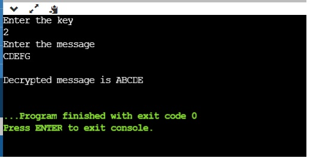
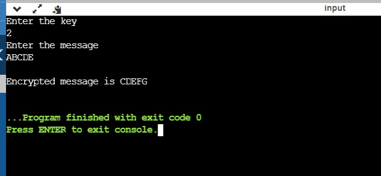

Caser Cipher Game
***
## Introduction
This is a code written in C++ Programming Language .
It is programme used to encrypt and decrypt the plain text.

***
## How to Use
1. Pull the code into your system.
2. Run **Caser Ciper to Decrypt.cpp**.
   To play for Decrypt the Text.
3. Run **Caser Ciper to Encrypt.cpp**.
   To play for Encrypt the Text.
4. Enjoy Playing the Game.

***
## Output

