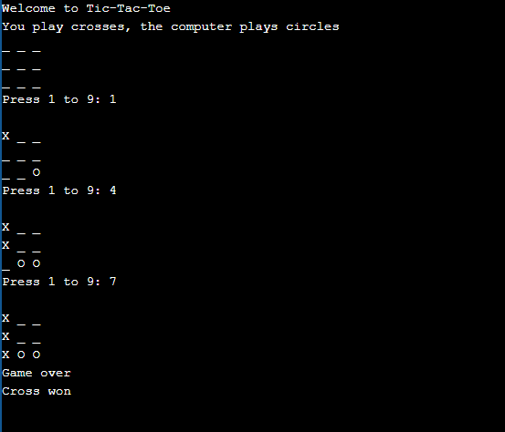

# Tic-Tac-Toe Game
***
## Introduction
This is a code written in C++ Programming Language for Tic-Tac-Toe Game.

***
## How to Use
1. Pull the code into your system.
2. Run **main.cpp**.
3. Enjoy Playing the Game.

***
## Output

