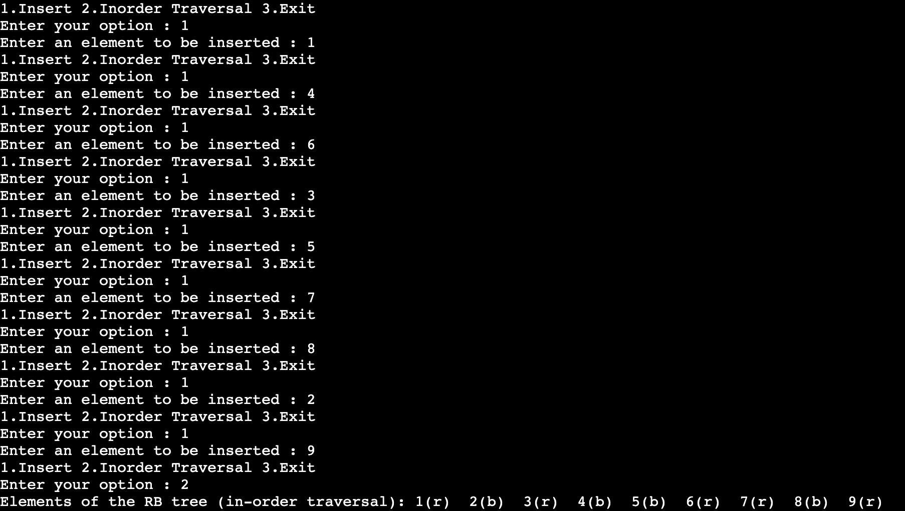

## Red Black Tree Insertion
---
## Introduction
A red-black tree is a kind of self-balancing binary search tree where each node has an extra bit, and that bit is often interpreted as the colour (red or black). These colours are used to ensure that the tree remains balanced during insertions and deletions. 

Rules for Inserting Nodes in Red Black Tree

1-If the tree is empty, then create a new node as the root node and colour it black.

2-If the tree is not empty, then create a new node as the leaf node with the colour red.

3-If the parent of a new node is of black colour, then take the exit.

4-If the parent of a new node is red, then check the colour of the parent's sibling of a new node.

a-If the colour is black or NULL' then do proper rotation and recolour it.

b-If the colour is red, then recolour it and check if the parent's parent of the new node is not the root node, then recolour it and recheck.

---

## How to use
1. Pull the code into your system
2. Run redblacktree_insertion.cpp file

---

## Input 
Based on choice - 1. Insert 
2. Inorder Traversal
3. Exit

## Output

