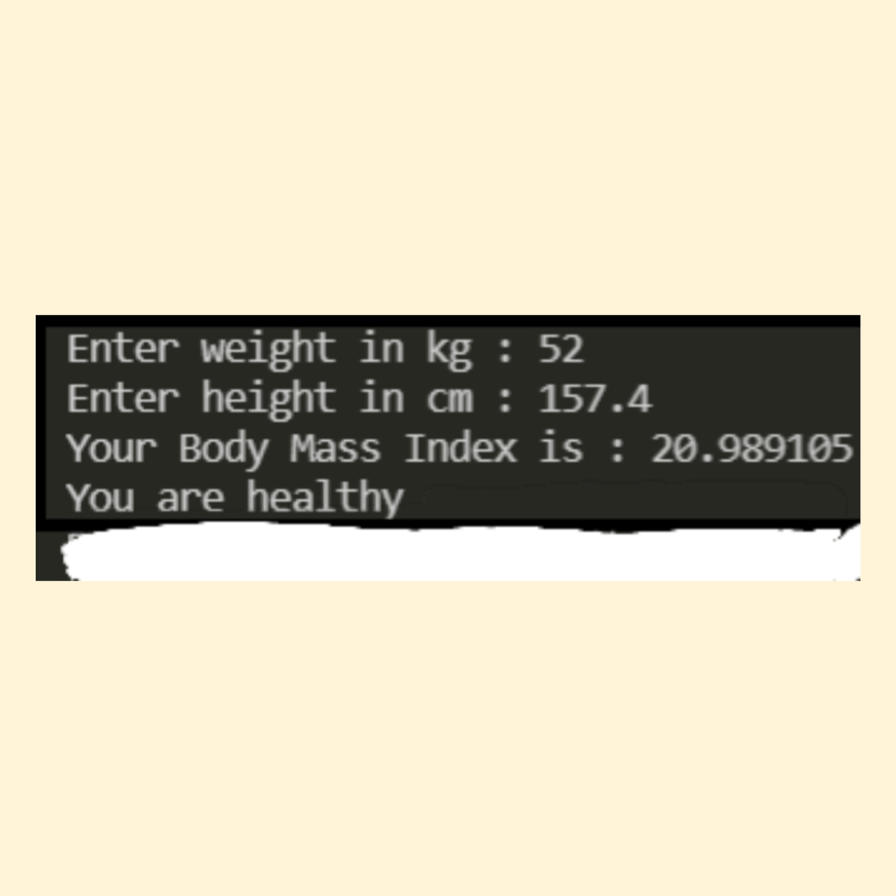

# BMI Calculator

## Introduction
It is a C program which asks the user to enter his weight and height. On the basis of that BMI is calculated and tells the user that he is fit or not.

***
## How to Use
1. Pull the code into your system.
2. Run **main.c**
3. Enter the weight and height.
4. BMI is calculated and gives the desired result.

***
# Third-Party Libraries Required :

gcc library

****

# How to install the above Library in Linux

sudo apt update
sudo apt install build-essential
sudo apt-get install manpages-dev

****

## SCREENSHOTS :
