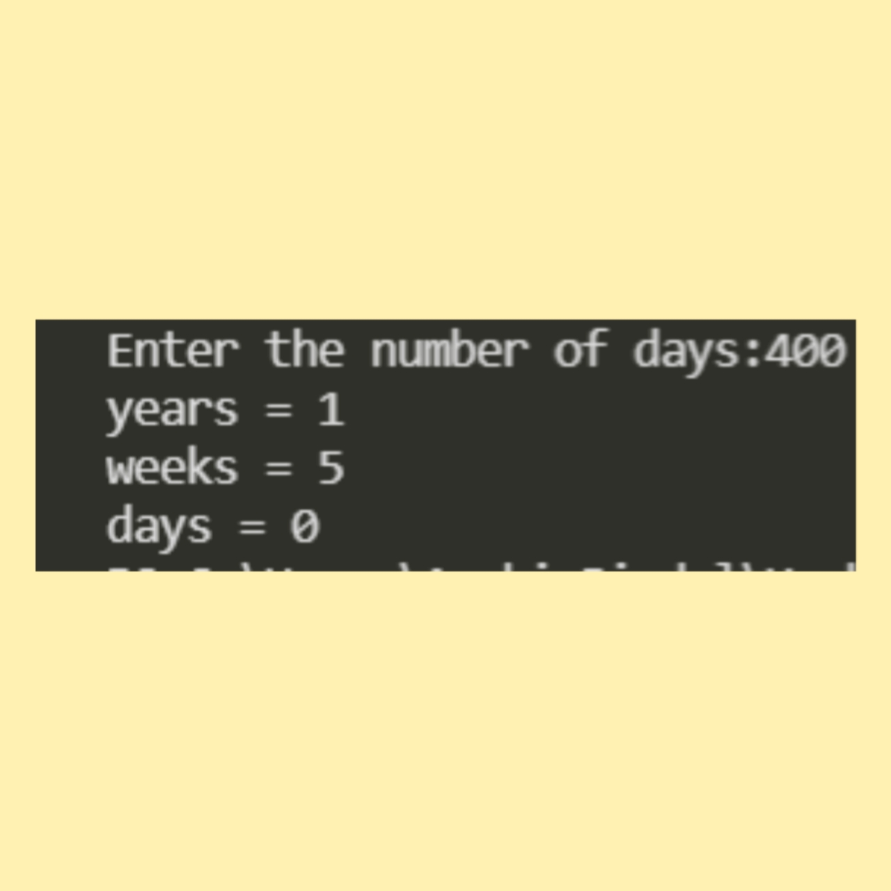

# Converter of days in terms of years, weeks and days

## Introduction
It is a C program which tells the user to first input the total number of days . It will then give the number of days in terms of years , weeks and days..

***
## How to Use
1. Pull the code into your system.
2. Run **main.c**
3. Enter the total number of days.
4. It will then give the number of days entered in terms of years, weeks and days.

***
# Third-Party Libraries Required :

gcc library

****

# How to install the above Library in Linux

sudo apt update
sudo apt install build-essential
sudo apt-get install manpages-dev

****

## SCREENSHOTS :
