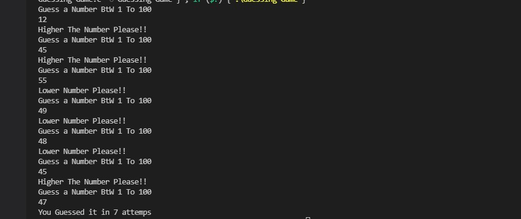

# Guessing Game
***
## Introduction
 A Number Guessing Game Generate Number Between 1 To 100  Using  C(Programming Language)

***
## How to Use
1. Clone the code into your system.
2. Run **Guessing-Game.c** 
3. Guess The Numer Between 1 to 100
4. The Guessing Number is lower It print "Higher Number Please!" or vice versa
5. You Guessed right Answer it print Total Number Of Attempts

***
## Output

