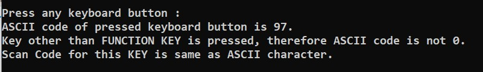
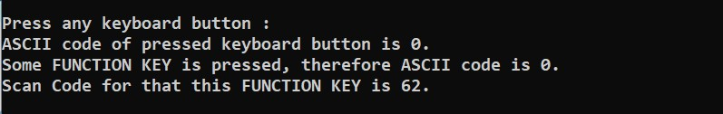
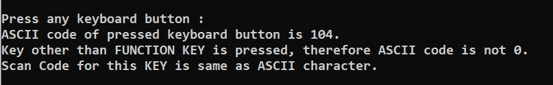
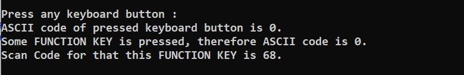

# ✔ KEYBOARD PRESSED KEY DETECTOR
- ### A C program to detect which key is presses on keyboard (either function key or any other).
- ### In this program, described how there interatction takes place between keyboard and computer mother board.
- ### Whenever is a key is pressed on keyboard, it generates a scan code and transfer this scan code to keyboard controller which is present in computer mother board.Then keyboard controller translate this scan code into 2 byte code, first byte contains ascii value and 2nd byte contain scan code.
- ### In this manner computer understand which key is pressed.

****

# SCREENSHOTS :

****

### When key 'a' is pressed. 
 
### When key 'F4' is pressed. 
 
### When key 'h' is pressed. 
 
### When key 'F10' is pressed.
 

****