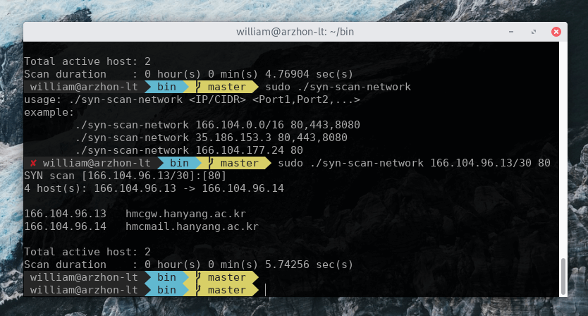

# Network Scanner
***
## Introduction
This is a code written in C(Programming Language) to show the IP and MAC-ADDRESS of the devices connected to the same network.

***
## Features
* Shows the Names of the Connected Devices.
* Shows the IP address of the Connected Devices.
* Shows the MAC-address of the Connected Devices.

***
## How to Use
1. Pull the code into your system.
2. Run **Network_Scanner.c**
3. Enter the Port Number if asked.
4. List of connected devices with their IP address and MAC-ADDRESS will be displayed to you.

***
## Output

