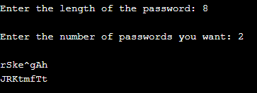

# Random Passwords Generator
***
## Introduction
This is a code written in C(Programming Language) to Generate Random Passwords.

***
## Features
* Generate 100% secure password.
* Random password generation.
* We do not store passwords in our system.

***
## How to Use
1. Pull the code into your system.
2. Run **RandomPasswordsGenerator.c**
3. Enter the Length of the Passwords you want to generate.
4. Enter the no. of Passwords you want to generate.
5. Specified no. of Passwords will be generated of your desired length.

***
## Output
