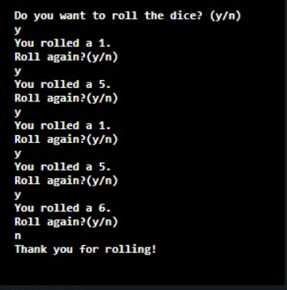

# RollDice  

## Introduction
```
It is the program that will help you to Roll the Dice.The java Random() class is used in this program to generate random numbers for the dice.
## Requirements
```
Java IDE
```
## How to use the code
```
1.Download the given code.
2.Open the project .
3.Run the RollDice.java file.
```
## Output



