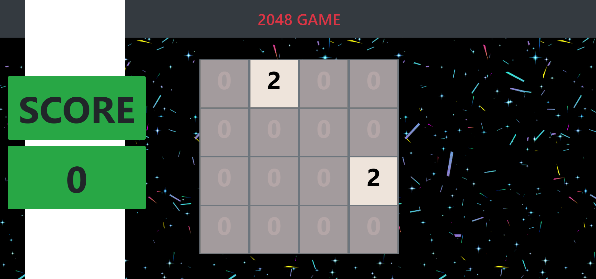
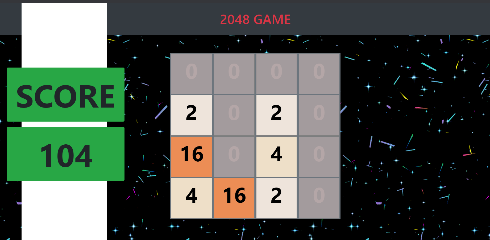

# 2048 Game 
## INTRODUCTION
### A 2048 Game made with html,css and javascript.2048 is a single-player sliding tile puzzle game.The objective of the game is to slide numbered tiles on a grid to combine them to create a tile with the number 2048; however, one can continue to play the game after reaching the goal, creating tiles with larger numbers.

### No packages or libraries are needed. 
## DESCRIPTION
The rules of the game are as follows:
1. There are some numbers on the board.
2. Swipe/key press any direction (up, down, left, right) to move all tiles.
3. A new tile of 2 will appear on the board after every move.
4. When two tiles with same numbers touch each other, they merge into one.
5. When the board is filled up, you lose.
6. When you create 2048 you win and can still care on the game to create more and more high scores.
## How to use 
Fork clone the repository or download the zip folder. 
Navigate to throught the javascript folder to the 2048 Game folder . 
Inside the 2048 Game folder run the index.html file. 
 
## TECH STACK USED
* html
* CSS
* JavaScript
 

## OUTPUT

