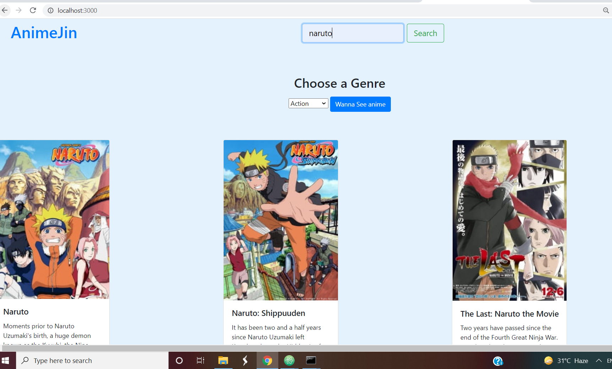

## AnimeJin

<b>T</b>is is a anime Recommendation System. You can search any anime on the website and view anime based on various Genres.

### Tech-stack used

- HTML
- CSS
- Node.js
- EJS

### More
Here I have used the Jikan API which will show the anime content as seen in the web-page.

## Third-Party Libraries Required :

ejs,body-parser,express,node-fetch

## How to install the above Library

To install all above libraries use :

npm i ejs node-fetch body-parser express

## How to use it :

IN Terminal/Hyper/cmd in folder location

node index.js           

## Homepage (top anime)

  

### Genre

 

### Search any anime

 
