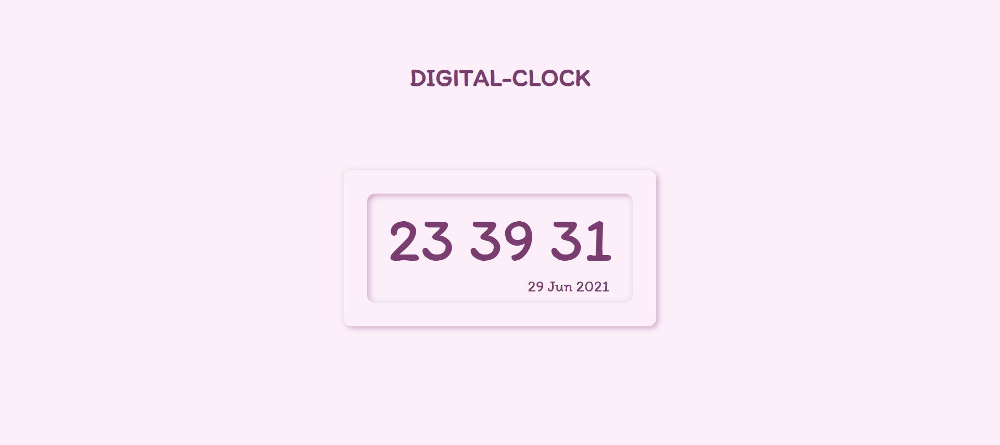

# Digital-Clock

## Description
It is a Simple Digital Clock made using Javascript

#### Steps:
---

- Download or clone the repository
```
git clone https://github.com/Tejas1510/Hacking-Scripts.git
```
- Go to the directory
- Run the index.html file
- Check the time

<br/>

#### Tech stack:
---
- HTML5
- CSS3
- Javascript

#### Clock Image:
---


