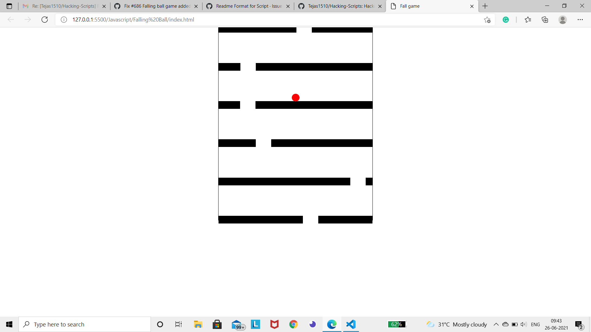
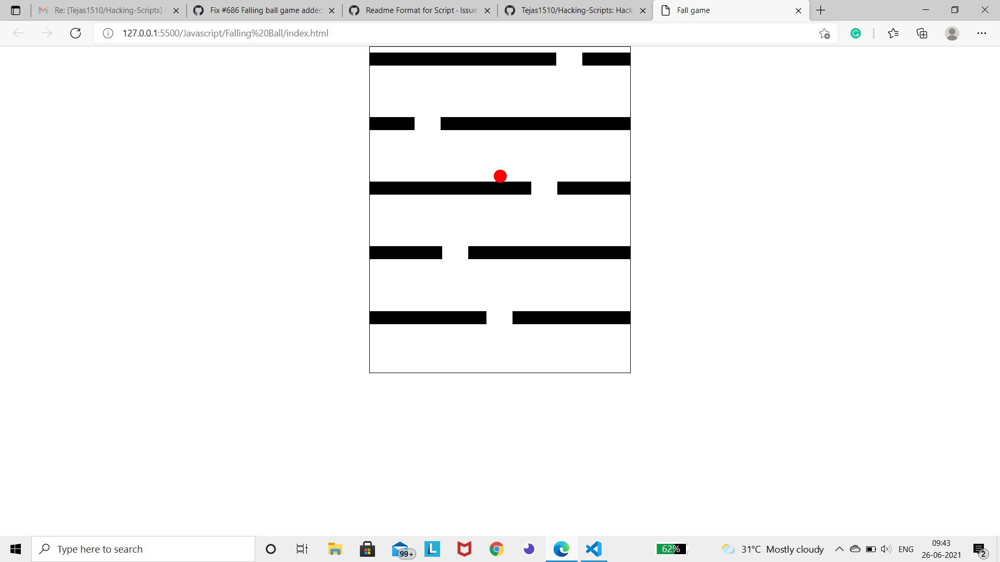
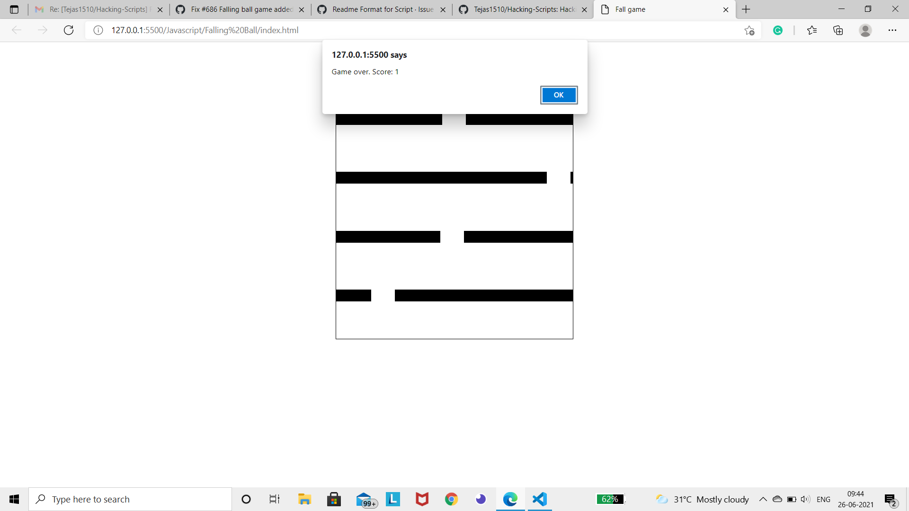

# Falling Ball Game using JavaScript

# Introduction

This is a falling ball game using JavaScript. In this game you roll the ball in between the blocks, once the ball touches the top of the grid then the game gets over.

# Third-Party Libraries Required :

No External libraries.
only HTML, CSS, and JavaScript.

## Steps to try this

1. Clone/Download this repository

```
git clone clone_path

```

## How to use it:

After Cloneing a repository

1. Open the Falling Ball folder.

2. Run index.html file / Open with live server

# Output





