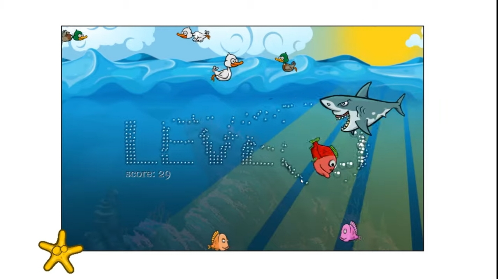

# Fish Game using Javascript

# Introduction

This is a 2D Fish Game created using Javascript. 

# Third-Party Libraries Required :

HTML, CSS, and Vanilla JavaScript.

## Steps to try this

1. Clone/Download this repository

```
git clone clone_path

```

## How to use it:

After Cloneing a repository

1. Open the Fish-game folder

2. Run index.html file.

# Output

# images


