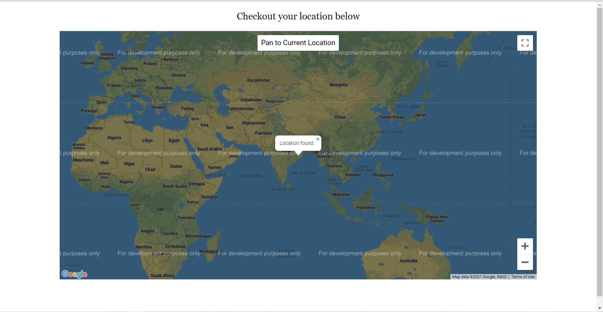

## Location Tracker

<b>T</b>his is a location tracker made using google maps api which gives your  real time location and also it gives proper error depending upon the type of error that occurs due to any issue. You have the options of zooming in and out too so that you get know the exact location.

### Tech-stack used

- HTML
- CSS
- JS

### Required

If you want to build this on your own you have to generate your own api key, also you need to enable javascript maps api. You can learn to do the same from <a href="https://www.w3schools.com/html/html5_geolocation.asp">here</a>.

### Screenshot 

