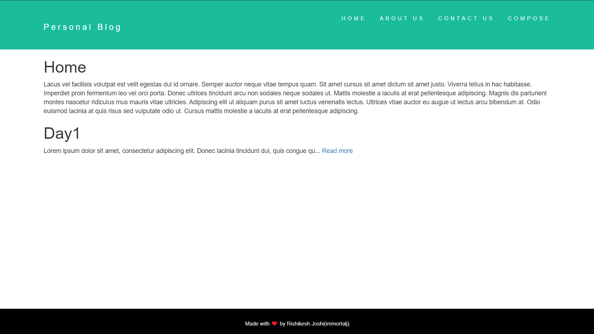
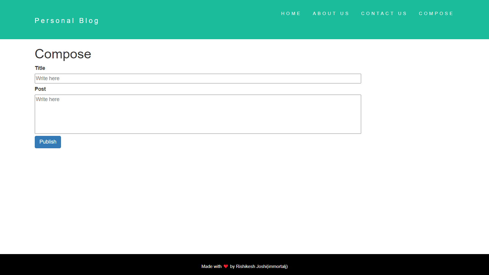
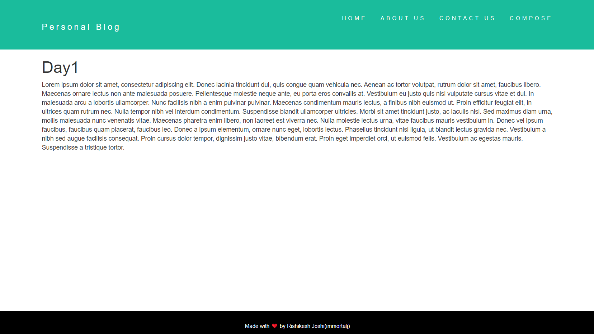

# Personal Blog Website

## Introduction

This is a Personal Blog website 
It is a full fledged site where one can compose and post blogs on home page along with about us and contact us page,
All newly created posts are be stored in database(MongoDB).Every post can be read in detail by clicking readmore.Each blog is rendered
on views/post.ejs dynamically whe readmore for a post is clicked.Website is currently hosted on localserver on port 3000.
Header and footer are used as partials/templates using ejs.
Website is made using NodeJs,EJS,HTML5,CSS,MongoDB.

## Third-Party Libraries Required :

ejs,mongoose,body-parser,express,lodash,nodemon

## How to install the above Library

To install all above libraries in one go use

npm i

manually one by one
npm i ejs
npm i mongoose
npm i body-parser
npm i express
npm i lodash
npm i nodemon

## How to use it :

IN Terminal/Hyper/cmd in filder location

To start the webite
Method 1:
node app.js           (no external library required)

Method 2:
nodemon app.js        (nodemon library required)

## Output

  

### Input Image

 

### OutPut Image

 

