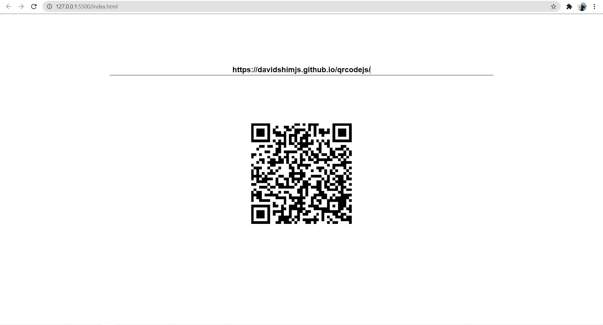

## QRCode Generator

### Description
``This is a QR code generator in which if you provide any text/link it will generate a quick response(QR) for you and you can too scan the qr code and browse that link.``

`[This](https://davidshimjs.github.io/qrcodejs/) library is used to make this qr code generator work.`

### Tech-stack
- HTML
- CSS
- Javascript

### Screenshot

