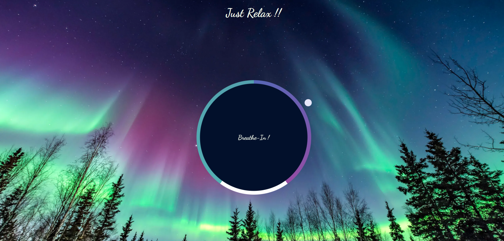
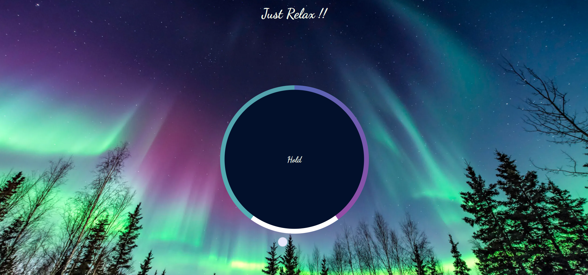
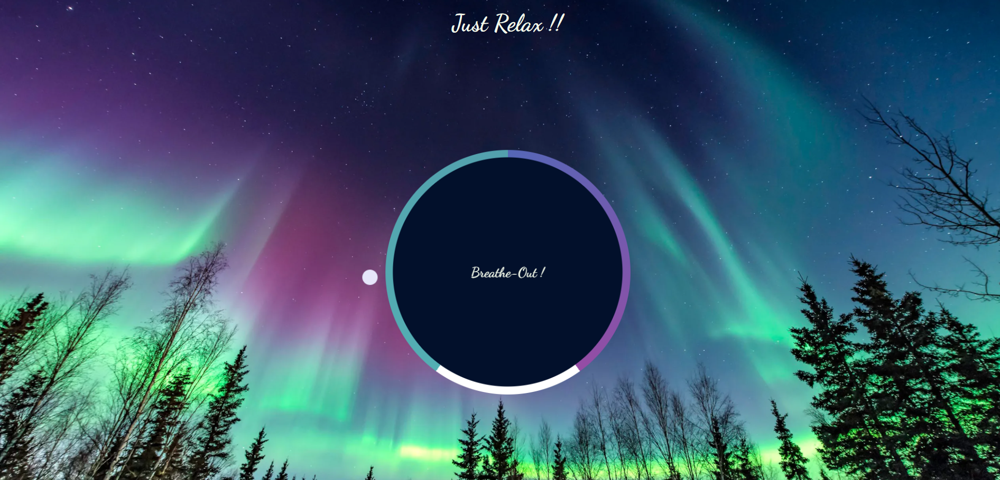

# Relaxer App

## Description
A relaxing breathing app with a visual director to tell you when to breathe in, hold and breathe out!!

#### Steps:
---

- Download or clone the repository
```
git clone https://github.com/Tejas1510/Hacking-Scripts.git
```
- Go to the directory
- Run the index.html file
- Relax

<br/>

### Breathe-In Stage Image

  

### Hold Stage Image

 

### Breathe-Out Stage Image

 

#### Tech stack:
---
- HTML5
- CSS3
- Javascript
