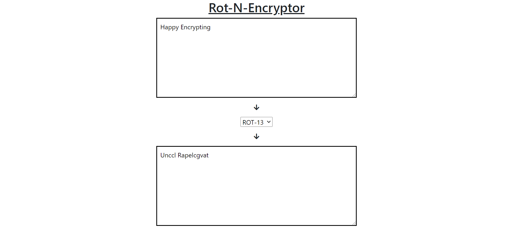

# Rot-N-Encryptor

## Description
It is a client side website that encrypts letters in strings that user inputs and displays them. Users can choose the value of rotation(which is set to 13 by default)

#### Steps:
---

- Download or clone the repository
```
git clone https://github.com/Tejas1510/Hacking-Scripts.git
```
- Go to the directory
- Run the index.html file
- Encrypt 

<br/>

#### Calculator image:
---



#### Tech stack:
---
- HTML5
- CSS3
- Bootstrap
- Javascript
- jQuery
