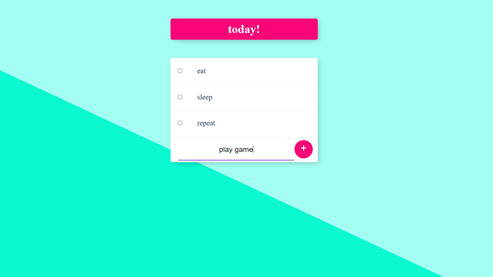
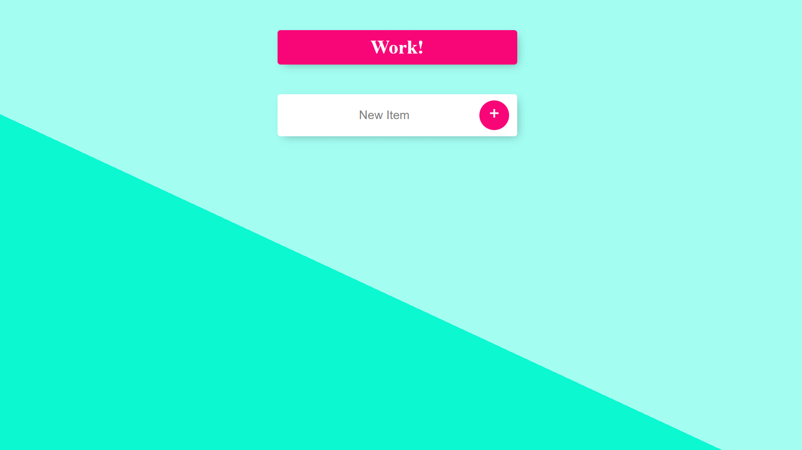
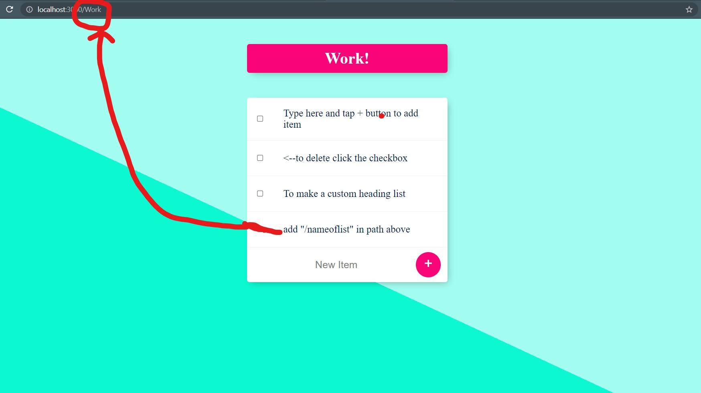

# Personal Blog Website

## Introduction

This is a Todo list website/app.
Multiple lists can be created by adding("/:nameoflist)in address.
Data is stored on local mongodb server can be replaced with another database server.
Items can be added and deleted from a list. 

## Third-Party Libraries Required :

ejs,mongoose,body-parser,express,lodash,nodemon

## How to install the above Library

To install all above libraries in one go use

npm i

manually one by one
npm i ejs
npm i mongoose
npm i body-parser
npm i express
npm i lodash
npm i nodemon

## How to use it :

IN Terminal/Hyper/cmd in folder location

To start the webite
Method 1:
node app.js           (no external library required)

Method 2:
nodemon app.js        (nodemon library required)

## Output

  

### Input Image

 

### OutPut Image

 

