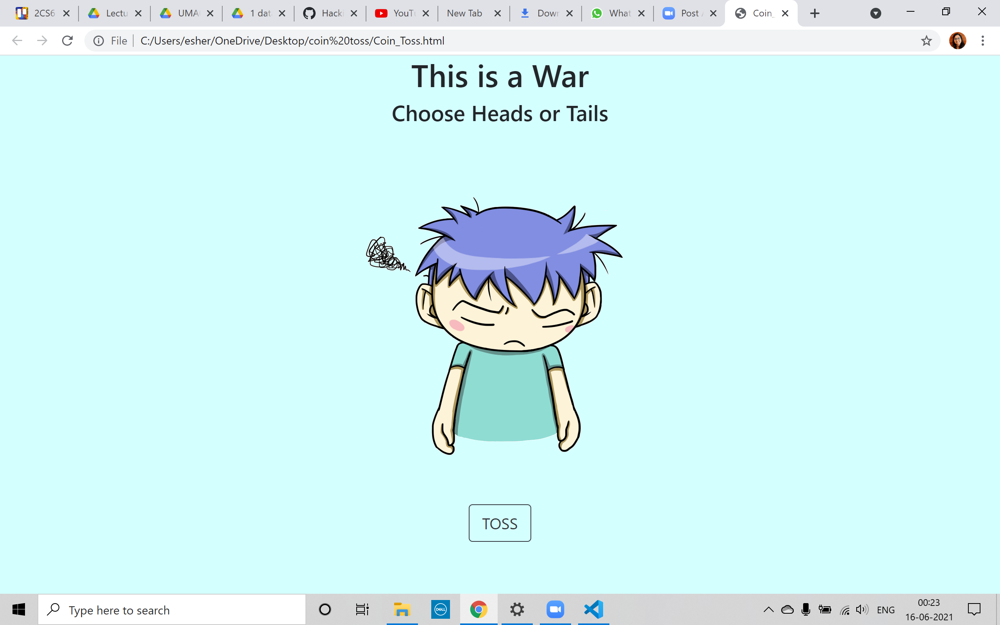
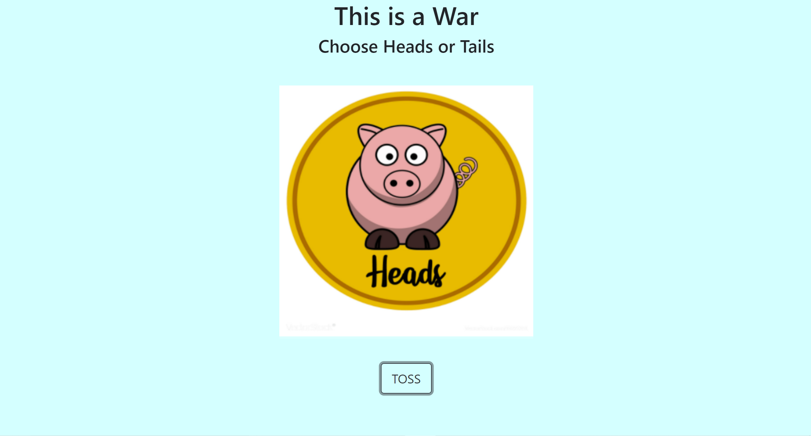
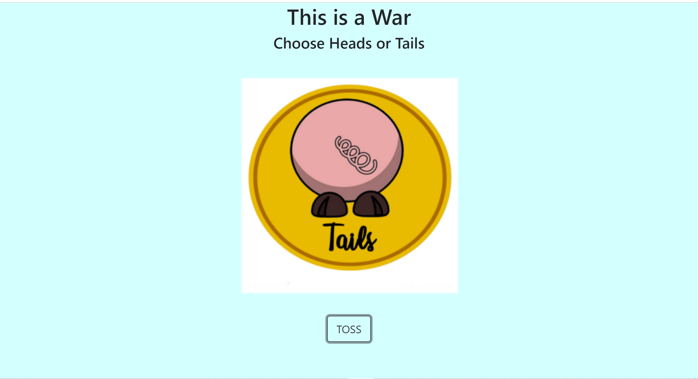

# COIN TOSS IN JAVASCRIPT 
## INTRODUCTION
### A basic coin toss game made with html,css and javascript 

### No packages or libraries are needed. 
## DESCRIPTION
A simple coin toss game that gives heads and tails randomly. 
The user clicks on the toss button and heads or tails is generated based on the random number generated by the function.
## How to use 
Fork clone the repository or download the zip folder. 
Navigate to throught the javascript folder to the coin toss folder . 
Inside the coin toss folder run the coin.html file. 
 
## Output

