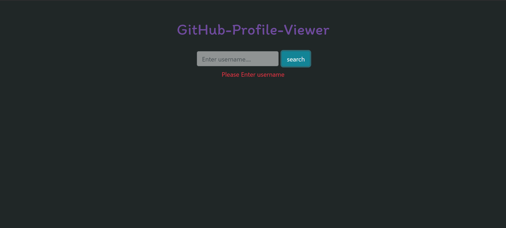

# Github Profile Viewer

## Description
It is a Github profile Viewer made using ES6 and jQuery

#### Steps:
---

- Download or clone the repository
```
git clone https://github.com/Tejas1510/Hacking-Scripts.git
```
- Go to the directory
- Run the index.html file
- Search for profiles

<br/>

#### Situations:
---
- User found


- User not found


- No username entered error



#### Tech stack:
---
- HTML5
- CSS3
- Bootstrap
- Javascript
- jQuery
