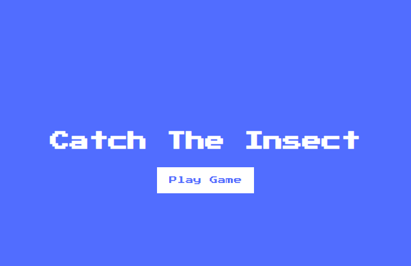
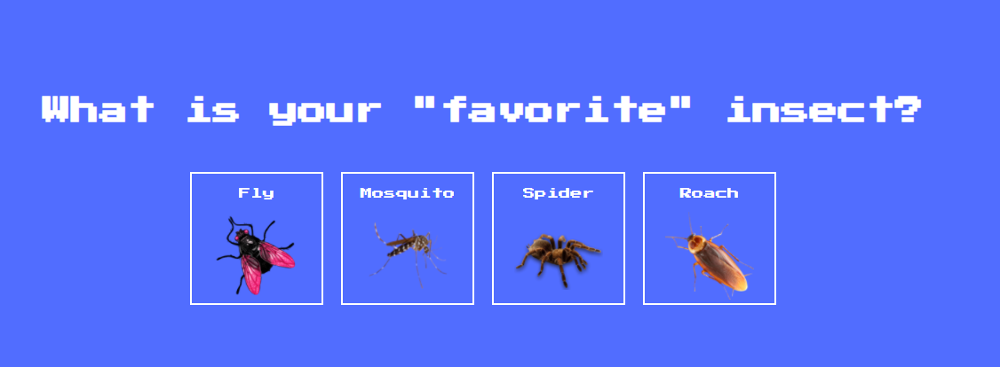
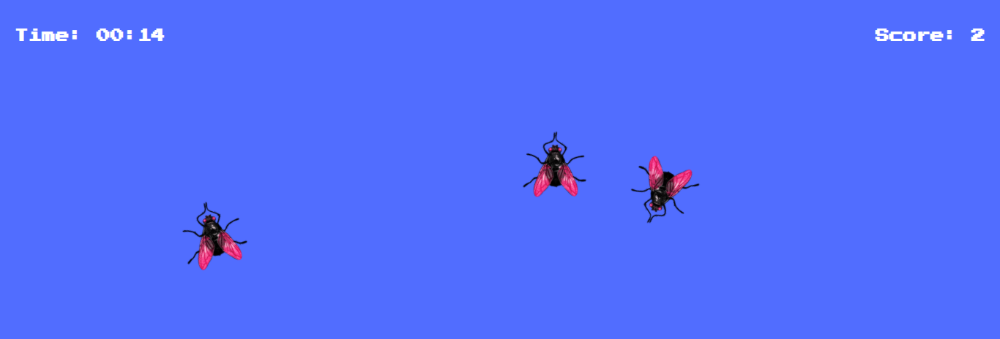

# Insect-Catch Game using Javascript

# Introduction

This is a Insect Catching Game created using Javascript. In this, you can select an insect and catch them. Score will be calculated.

# Third-Party Libraries Required :

No External libraries.
only HTML, CSS, and JavaScript.

## Steps to try this

1. Clone/Download this repository

```
git clone clone_path

```

## How to use it:

After Cloneing a repository

1. Open the insect-catch-game folder

2. Run index.html file.

# Output

## Input Image




## Output Image


