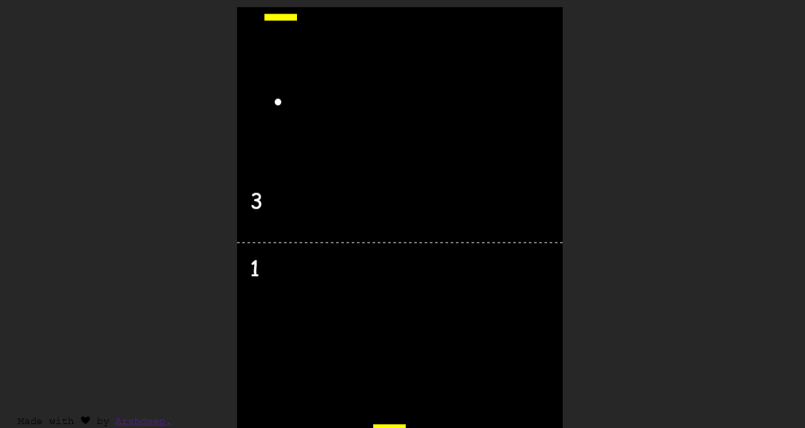
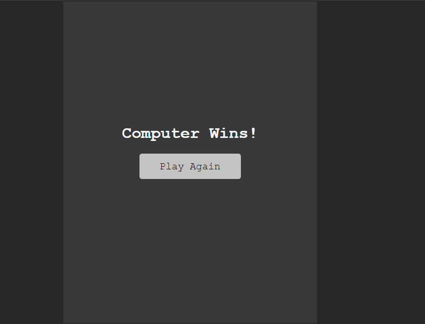

# Ping-Pong using Javascript

# Introduction

This is a Ping-Pong Game created using Javascript. You can play game against the computer. Score is being calulated.

# Third-Party Libraries Required :

No External libraries.
only HTML, CSS, and JavaScript.

## Steps to try this

1. Clone/Download this repository

```
git clone clone_path

```

## How to use it:

After Cloneing a repository

1. Open the ping-pong folder

2. Run index.html file.

# Output

## Input Image



## Output Image


