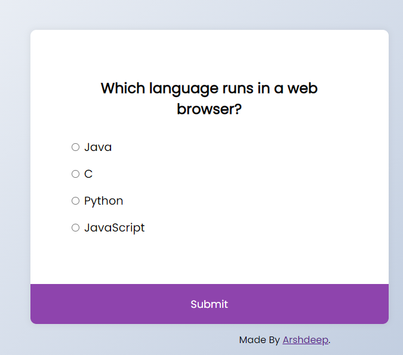

# Quiz App using Javascript

# Introduction

This is a Quiz app. It's a basic structured UI for Quiz built with HTML, CSS, & JavaScript.
New Questions can be added to the quiz in the JS file. And take a quick test. I have added some basic web development questions.

# Third-Party Libraries Required :

No External libraries.
only HTML, CSS, and JavaScript.

## Steps to try this

1. Clone/Download this repository

```
git clone clone_path

```

## How to use it:

After Cloning a repository

1. Open the quiz-app folder

2. Run index.html file.

# Output

## Input Image



## Output Image


