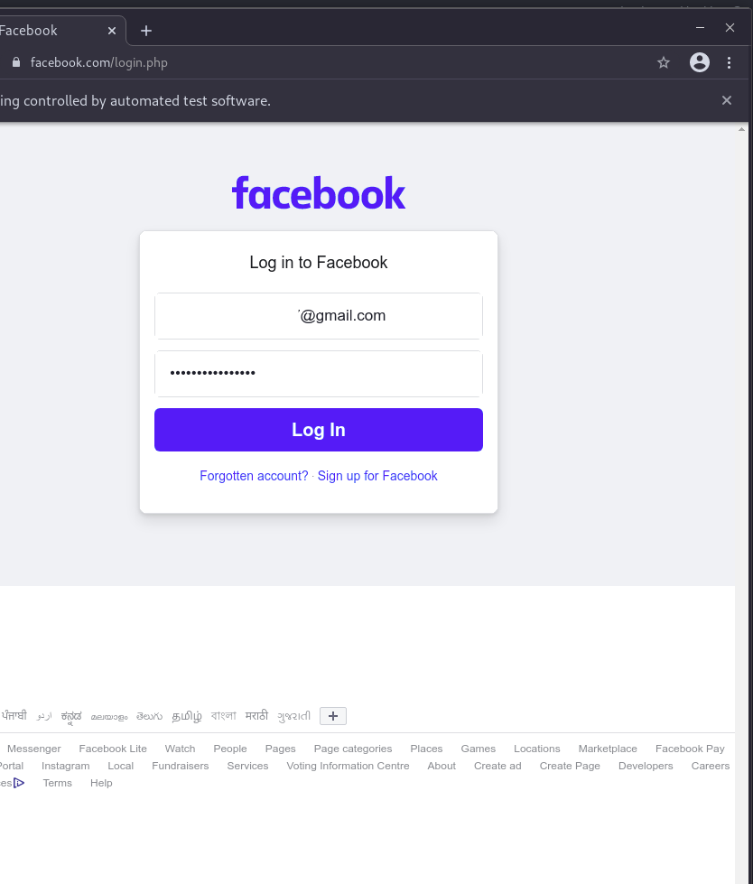

## Automate Facebook Login using Python.
- ### Installing necessary packages
```bash
pip install -r requirements.txt
```
- ### Download the webdriver for chrome in order to run the script according to your Operating System and Chrome version[From Here](https://sites.google.com/a/chromium.org/chromedriver/downloads)

*Note :* Move the webdriver to the same directory where script is present.

- ### Finally run the Python script
```bash
python3 Login.py
```
- ### **Input**


- ### **Output**
