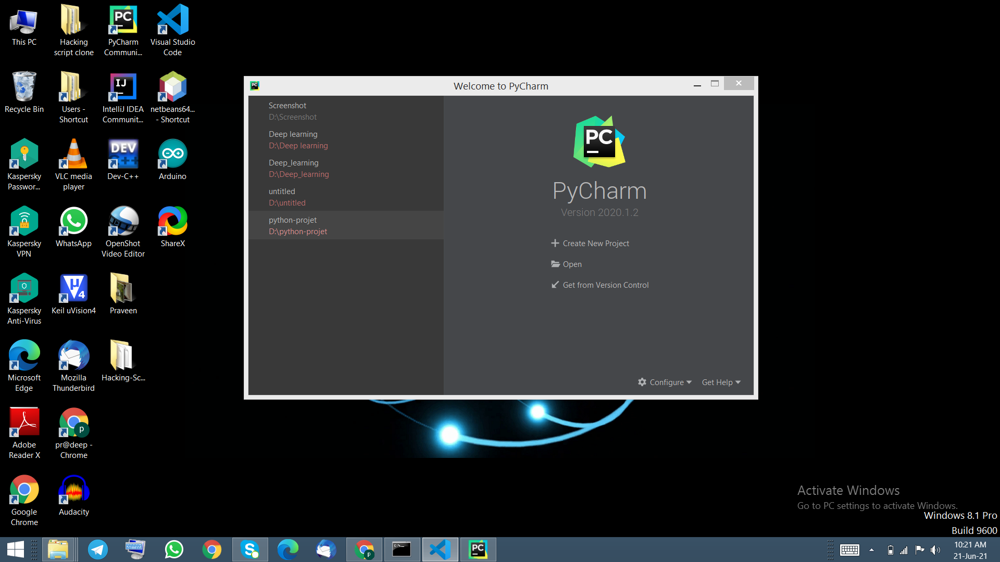
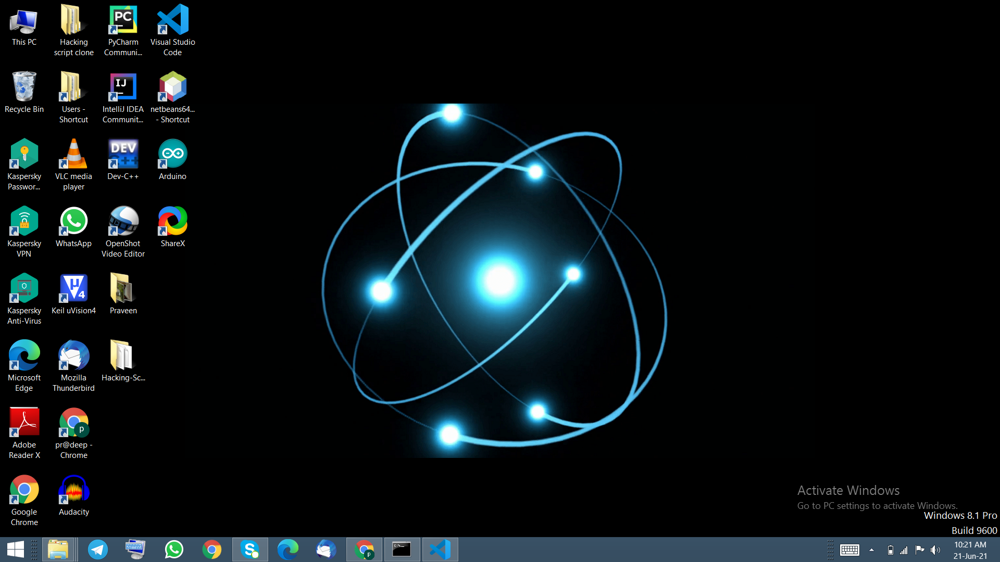
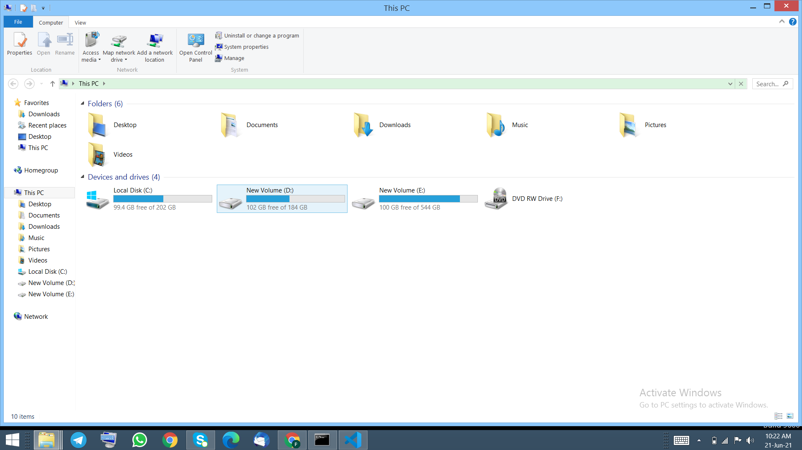
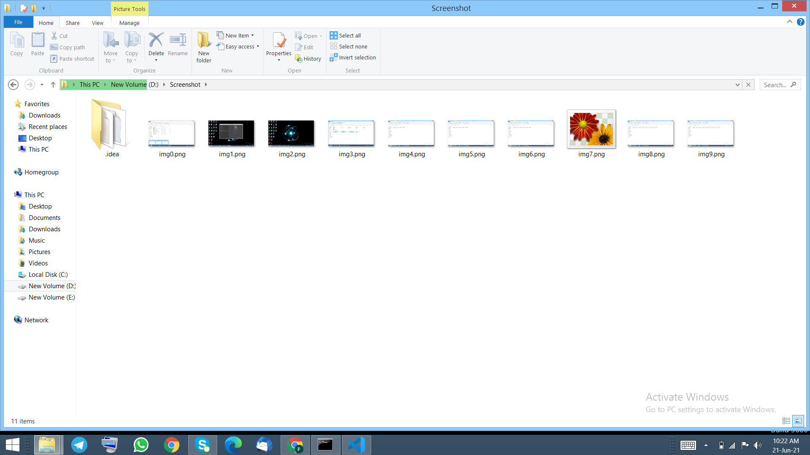
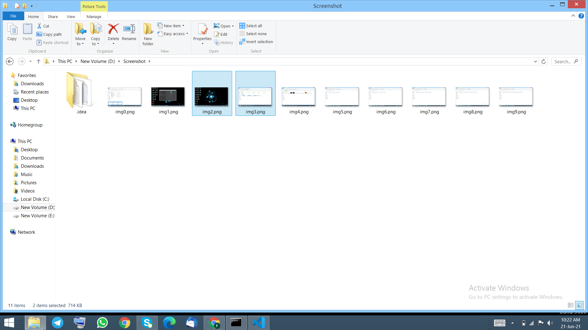

# Automate Your screenshot function using python

## Introduction
If your a college student and boared of taking screenshot of your online class then this code will defintely help you a lot.
You can automate screenshot funtion using python by this simple code.

## How to install library
pip install pyautogui
pip install time

## How to use 
1. You has to make a folder anywhere you wish were you want to store screenshot.
2. Give the path of the folder to "img.save("path_name)".
3. Run the code based on your prefered IDE.
4. Make sure that when you run the code again change the path or change folder because the new      screenshot will overide the old screenshot.
5. You can customize based on your need.

## Output 

s

