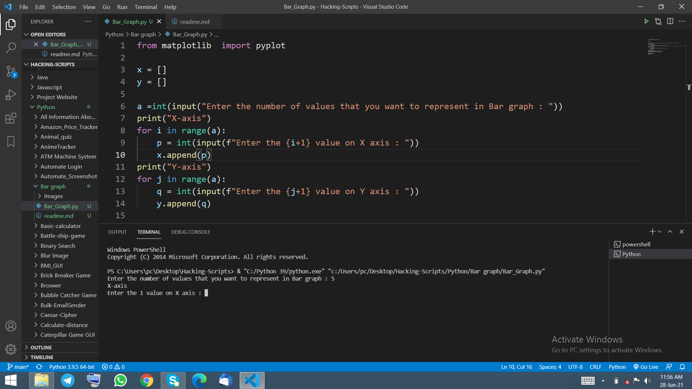
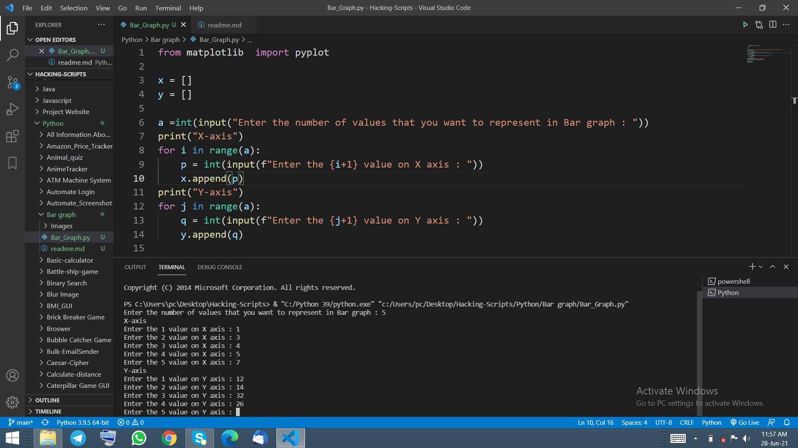
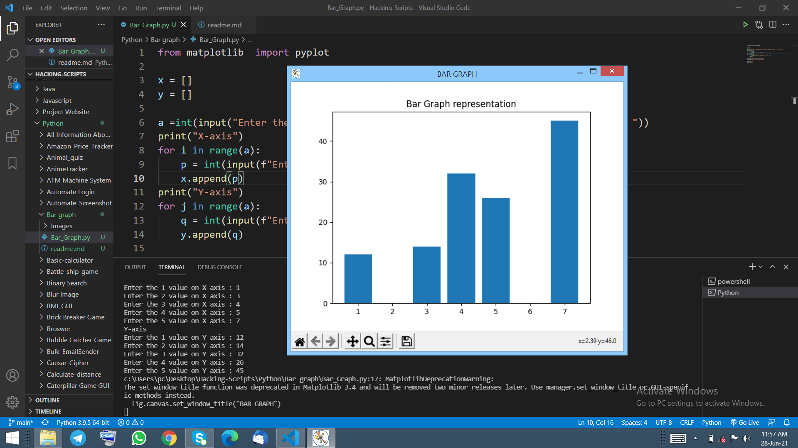

# Create a bar graph based on user input in python

## Introduction
You can create a bar graph to your project or any presentation by this programme.

## How to install library
pip install matplotlib

## How to use
1. You has to install all the library mentioned above.
2. Run this programme in your command prompt or any terminal.
3. Enter the number in X axis and Y axis.
4. You will get bar graph as the output based on your input.

## Output

