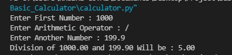

# Basic_Calculator
<i><b>A Simple  Baic Calculator Using Python  Programmimg language That Take Input from User and Print Division, Multiplication, Addition and Subtraction,Mudulus as Per User’s Choice.</b></i>

## How To use
1. Fork the Code In your Local Enviroment
2. Run **calulator.py** in Python IDE
3. Enter First Number 
4. Enter Valid Arithmetic Operator
5. Enter Anthoer Number

## Examples :
### Addition

### Subtraction

### Multiplication

### Division

### Modulus

