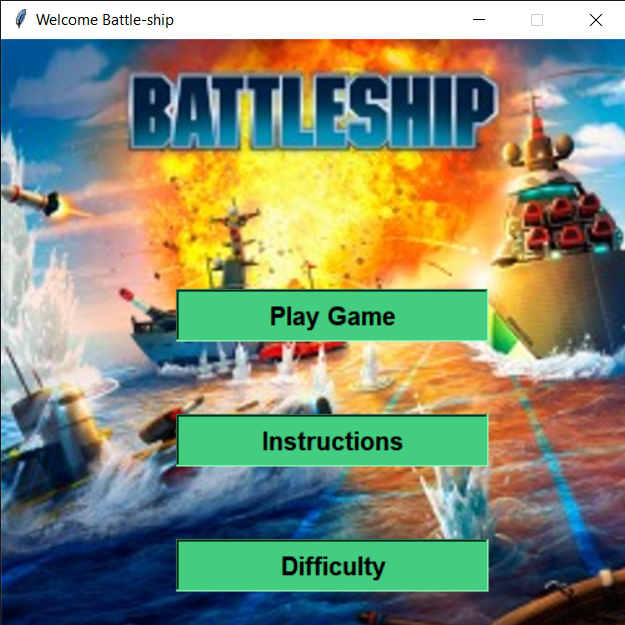
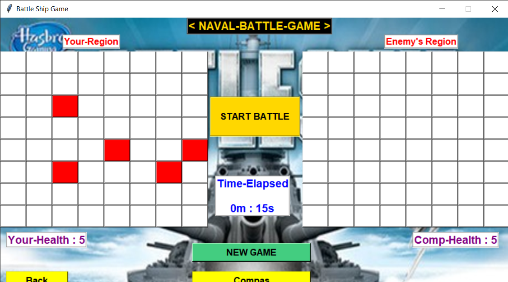

# BattleShip Game
This is battle ship game where player plays against computer or another player at multiple difficulty levels.

## Features
Game can be broadly be classified in 2 features :-
1) Single player mode : 
    -->Selection of Difficulty level
    -->Get hints of enemy location by a compas feature
    -->Blast and fire sound
2) Multiplayer mode : 
    -->Cant see each others ships placed
    -->Selection of Difficulty level
    -->Get hints of enemy location by a compas feature
    -->Blast and fire sound

## How to run --
1-Install following modules
```
python -m pip install --upgrade pip
pip install -r requirements.txt
```
2- Run the application
```
python game.py
```

### Working ScreenShot




