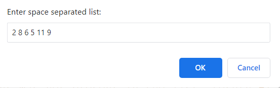
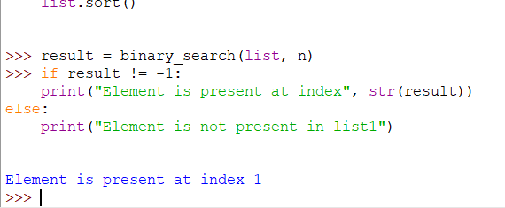

# Phrase Guessing Game

***

## Introduction

A binary search is an algorithm to find a particular element in the list. Suppose we have a list of thousand elements, and we need to get an index position of a particular element. We can find the element's index position very fast using the binary search algorithm.

***
## Input Image

## Output Image

## How to use: 

1. Run the script.
1. Enter information as asked.
1. Get the desired result.