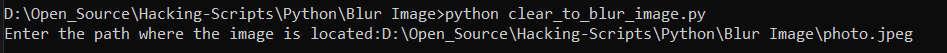
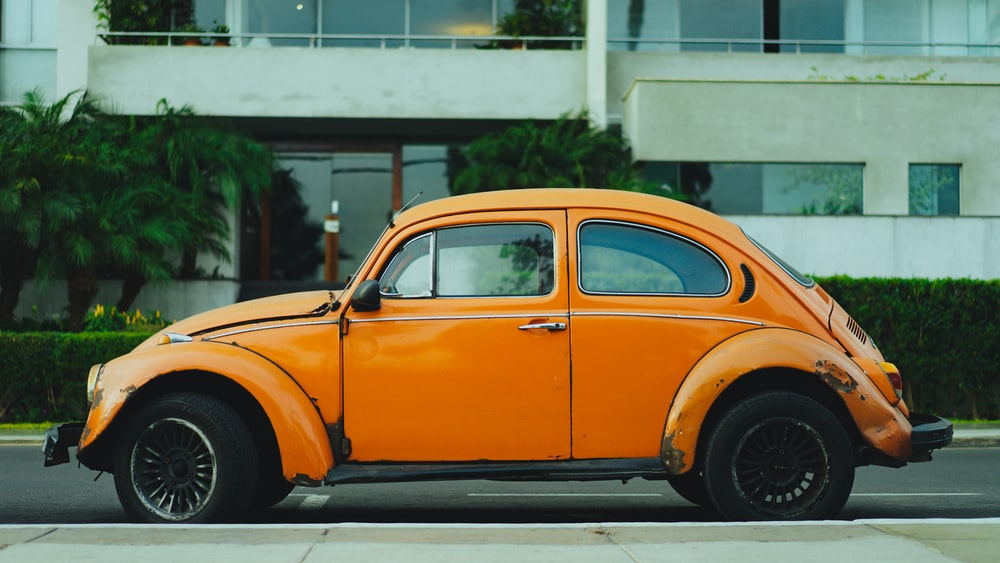

# Clear Image To Blur using Python
Using this script, a clear can be converted into a blurred image using the python PIL library.

### Requirements
For this project, we require the PIL library. To install the PIL library use the below command.
``` pip install pillow ```

### Methodology
1. Import 'Image' and 'ImageFilter' from PIL library in python file.

2. Set the path of the image you want to blur.

3. 'Image' and 'ImageFilter' methods will open and convert the image into a blurred image.

4. The blurred image will be saved where this python script is located in the system.

### Input




### Output

