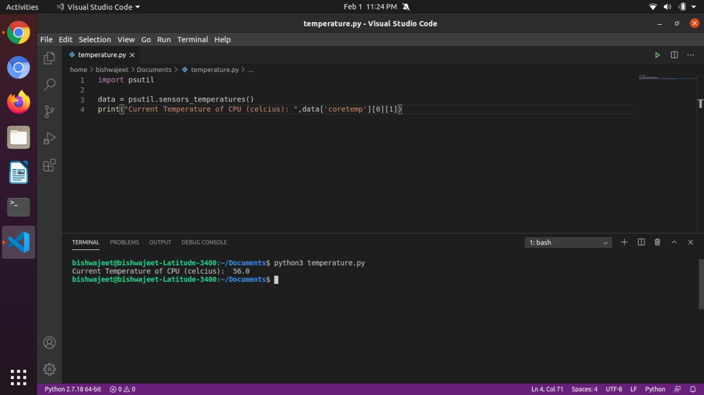

### About psutil

- psutil (process and system utilities) is a cross-platform library.
- It is used for retrieving information on running processes and system utilization (CPU, memory, disks, network, sensors) in Python.

### How to install psutil.

- pip install psutil

### How to measure CPU Temperature

- "import psutil" in your code
- Use inbuilt function "sensors_temperatures()" to measure temperature of CPU

### Implementation Sample
