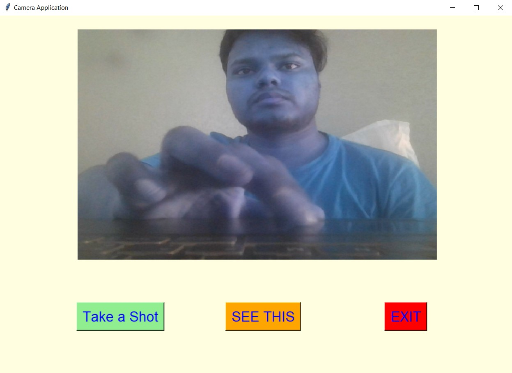
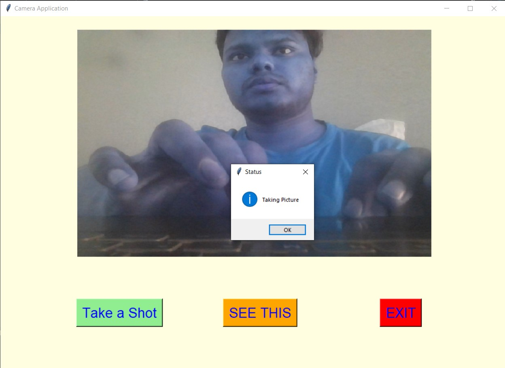
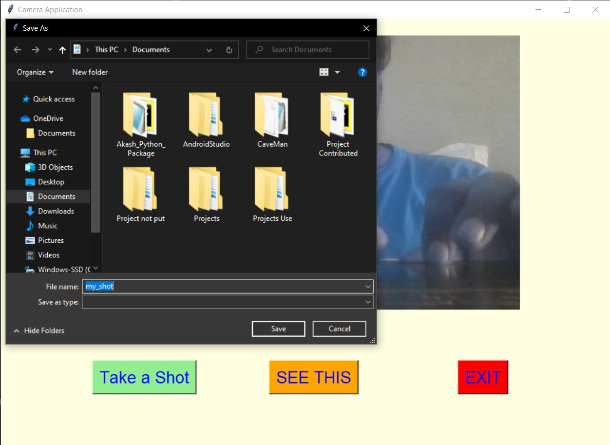
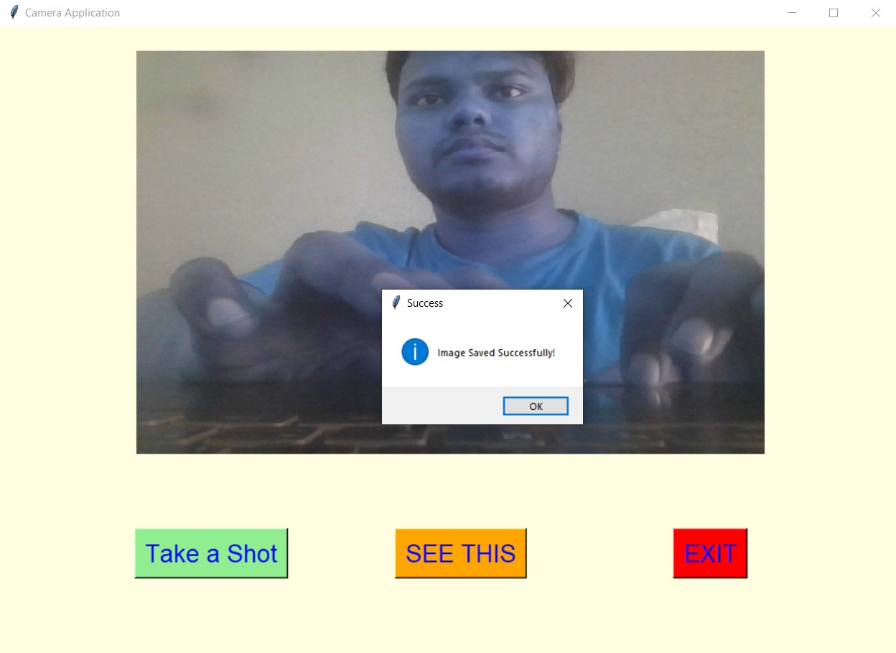
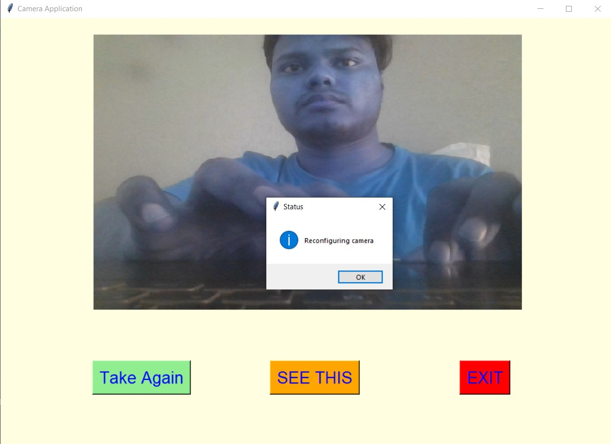
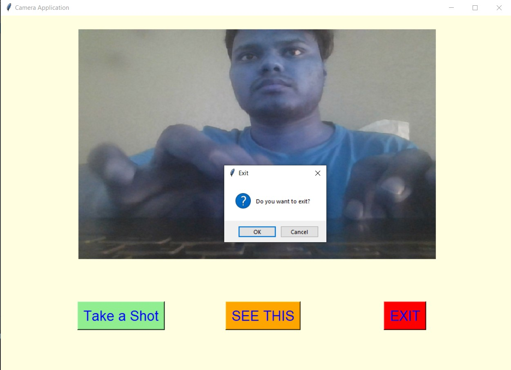
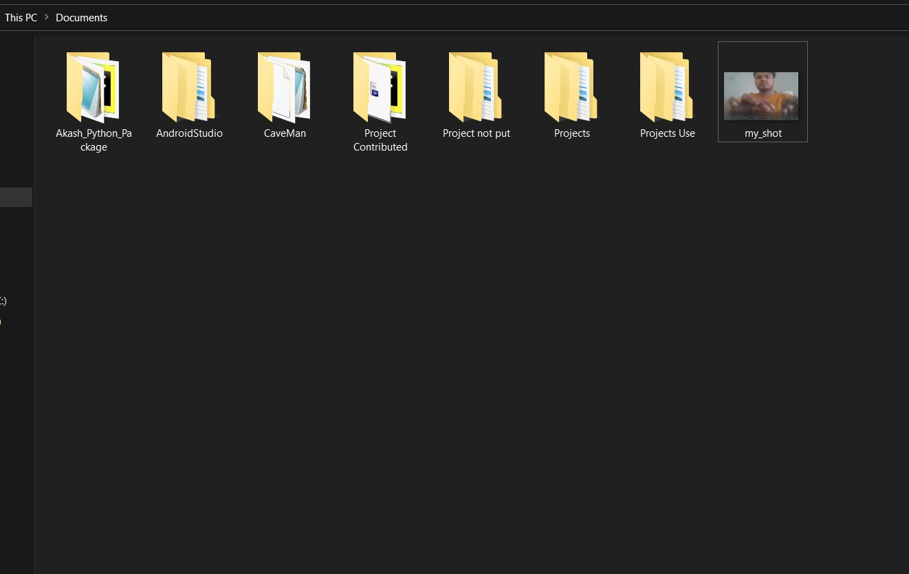

# ✔ CAMERA APPLICATION
- ### A Camera Application is a simple camera created in python with tkinter gui and OpenCv library.
- ### Using this user can take any no. of pics/shots and also will be able to save the image to any location in the local system.
- ### In this application also put the button which shows how the this camera application works.

****

# REQUIREMENTS :
- ### python 3
- ### os module
- ### tkinter module
- ### filedialog from tkinter
- ### messagebox from tkinter
- ### PIL
- ### cv2
- ### time
- ### threading

****

# HOW TO Use it :
- ### User just need to download the file, and run the camera_application.py, on local system.
- ### After running a GUI window appears, which opens a camera and option option to take the photo.
- ### Also there is a SEE THIS button, which shows how this Camera Application works.
- ### When you click on Take a Shot, It will show a message of taking image. When we click on OK, it will ask user to save at any location in local system. After saving, it will show message, that File Saved Successfully. After that when user click on Take Again button, it willl give a message og reconfiguring camera, and clicking on the OK will start the camera and user can take the shot again.
- ### Also there is exit button, clicking on which we get a exit dialog box asking the permission to exit.

# Purpose :
- ### This scripts helps take any no. of shots or pics and saved at any location in local system.

# Compilation Steps :
1. Clone/Download this repository
```
git clone clone_path
```
2. Install the requirements using the command
```
pip install -r requirements.txt
```
3. Run the program using command
```
python camera_application.py
```
****

# SCREENSHOTS :

****

<p align="center">
  <br>
  <br>
  <br>
  <br>
  <br>
  <br>
  <br>
  <br>
</p>

****

# Below is a sample gif showing how Camera Application works:
<p align="center">
  <br>
</p>

****
