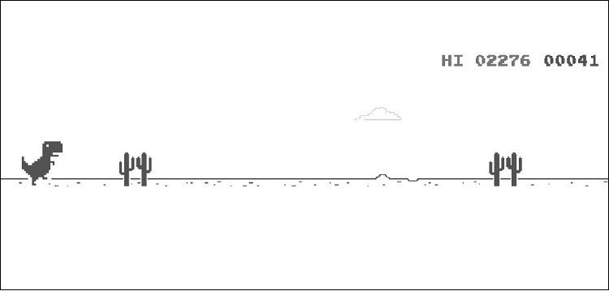

# 
 Python Script for Automating the Chrome Dinosaur Game 

## Introduction: 
This is a script that aims to automate the Chrome Dinosaur Game which is a usual pastime activity following if there's no internet on the system. After running the script, it maps the obstacles coming forward and sets the timing of the dino sprite's jump automatically in a continuous process to increase the score. 
## Third-party libraries required:
The project requires `pyautogui`, `PIL` and `time` Library of Python 
## Installing and Importing the Libraries:
Open Command Prompt on your computer and type the following:

`pip install pyautogui`  
>Note: The `time` and `PIL` libraries come pre-installed with Anaconda Distrbiution

### To import the libraries into the code
`import pyautogui`\
`from PIL import Image, ImageGrab`\
`import time`

## Running the Script:
Open the Dinosaur Run game by typing `chrome://dino` in your Chrome browser. Make sure that all the mentioned library modules are installed in your system. 
After exceuting the script on your IDE, immediately switch to the chrome browser and then press the `↑` arrow key of your keyboard or the `spacebar` to start the game.

**Note:**
> The script will run well for a few thousand points only as the dino's speed increases and obstacles change course. In order to further implement that, we need to use Machine Learning algorithms. 

## Output:
