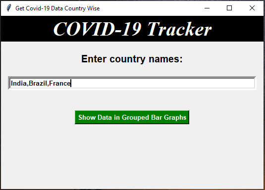
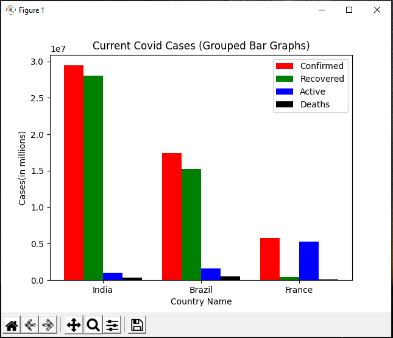

# Covid19-tracker-application
## Overview
The aim of this project is to track the Covid-19 cases across the world. This application is built using four different python libraries they are tkinter for Graphical User Interface, matplotlib to show data graphically, covid to get the COVID data, numpy for arrays. The GUI consists of an Entry widget where the user need to enter the country names for which data is needed. After country names are entered, if we click the button the data will be displayed graphically.
## The widgets used in development of this frontend are
* Label
* Entry
* Button
## Prerequisites
* Firstly you need to have a Python 3.x in your PC, you can [download here](https://www.python.org/downloads/)
* You need packages like tkinter and matplotlib. For that you have to use the below commands
* pip install tkinter
* pip install matplotlib
## Procedure to run
* Download and run the "Covid19 tracker application.py"
* Give the required country names.
* Click the button on the window.
* It will show the data in the form of grouped bar graphs.
## Sample output

## Contributor
#### @LasyaGanesuni
