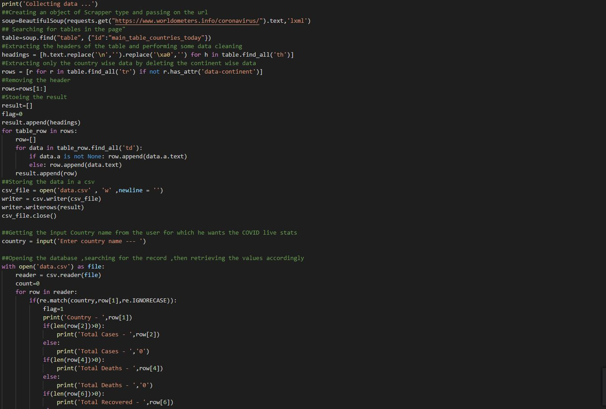
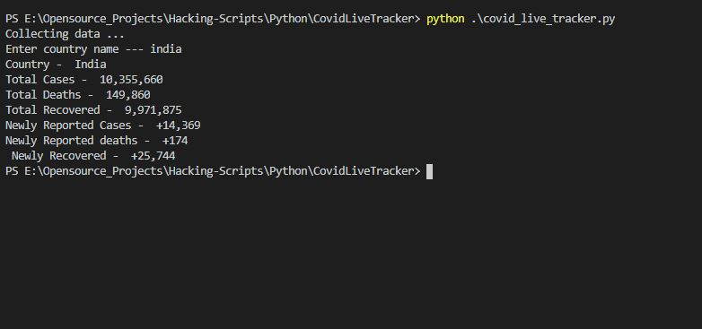
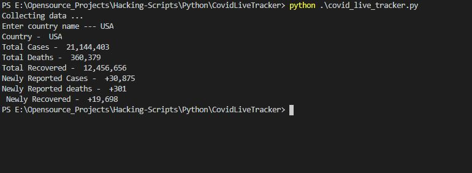

# COVID-19 Live Tracker

This is a python script which can help you to find out the total cases,deaths,recovered as well as new cases,deaths,etc for a given country

## Steps to make it run

1. Clone/Download this repository
2. Install the requirements using the command
```
pip install -r requirements.txt
```
3. Run the program
Each time when you run the program the data file will get updated to the live COVID-19 count
4. Give any country of your choice and see the result


## Input 


## Output

> COVID stats for India


> COVID stats for USA


> COVID stats for Norway

