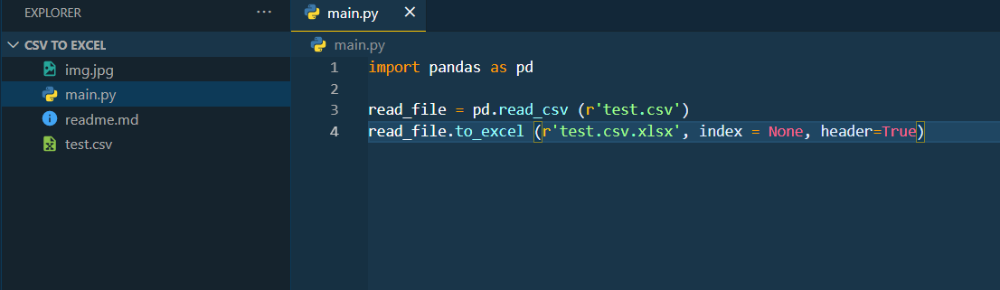
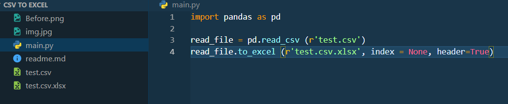

# Convert CSV to Excel using Python 
# introduction
## The Python Script Using Pandas Which Convert Csv File To xlsx
## Install the Pandas package
## If you haven’t already done so, [install the Pandas package.](https://datatofish.com/install-package-python-using-pip/)

```
pip install pandas
pip install openpyxl
```

```
import pandas as pd

read_file = pd.read_csv (r' give the location where the CSV file is stored\File name.csv')
read_file.to_excel (r'give the location to store the Excel file\File name.xlsx', index = None, header=True)
```
# How To Use
## Output
### input image

<hr>

### output image


